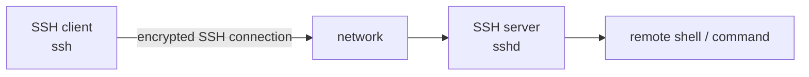

# SSH Basics

## 1. What SSH is

**SSH (Secure Shell)** is a protocol for securely accessing a remote system and executing commands. OpenSSH is a widely used implementation.

The notes emphasize a text/terminal session rather than a graphical desktop application.

Basic syntax:

```bash
ssh username@host
```

Example form from the notes:

```bash
ssh name@192.168.1.108
```

A more explicit form is:

```bash
ssh -p 22 username@192.168.1.108
```

Port `22` is the conventional default SSH server port, but servers may be configured to use a different port.

## 2. Client/server model



Conceptually:

```text
Client (ssh)  --->  network  --->  Server (sshd)
```

Commands typed after login execute on the remote machine, so the prompt/username normally reflects the remote account.

## 3. Requirements for a working connection

Typical requirements:

1. SSH server reachable on its configured port.
2. A valid user account.
3. A supported authentication method (password, key, etc.).
4. Network routing/connectivity and no firewall/access-control rule blocking the connection.

## 4. Exiting

```bash
exit
```

or press `Ctrl-D` at an interactive shell.

## 5. Remote command without an interactive shell

SSH can execute one command directly:

```bash
ssh username@host 'pwd'
ssh username@host 'ls -la'
```

This is useful in scripts and automation because SSH can authenticate, execute the command, return output, and terminate without opening a persistent interactive shell.
> **Verification status:** The commands and behavioral descriptions in this file were checked against current/official documentation where practical. Where a handwritten example differs from current behavior, the corrected behavior is stated explicitly so this file can be used independently.

