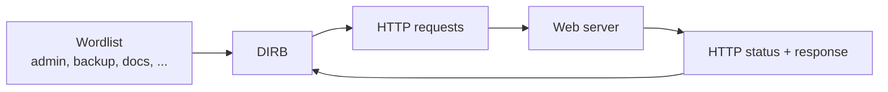

# DIRB / Web Content Enumeration

## 1. Goal

The notes introduce a security-testing mindset: look for web content that exists but is not linked from the visible site.

`dirb` is a **web content scanner** that performs dictionary-based discovery of existing or hidden web objects. It is a content discovery tool, not a general-purpose vulnerability scanner.

Only use it against systems you are authorized to test.

## 2. Hidden web content concept

A website might expose paths such as:

```text
/admin
/backup
/docs
```

without linking to them from the main page.

A wordlist provides candidate names. The scanner requests each candidate and analyzes the HTTP response.



## 3. Wordlists

The notes mention SecLists as a large collection of security-testing wordlists:

```text
https://github.com/danielmiessler/SecLists
```

Kali also includes DIRB wordlists such as:

```text
/usr/share/wordlists/dirb/common.txt
/usr/share/wordlists/dirb/big.txt
/usr/share/wordlists/dirb/small.txt
```

## 4. Basic syntax

```bash
dirb <url_base> [wordlist] [options]
```

Example:

```bash
dirb http://example.test/
dirb http://example.test/ /usr/share/wordlists/dirb/common.txt
```

An IP address can be used instead of a hostname when appropriate:

```bash
dirb http://10.15.1.12/
```

## 5. Important options from the notes

```bash
dirb http://example.test/ -o Result.txt
```

`-o` saves output to a file.

```bash
dirb http://example.test/ -X .php
```

`-X` adds extension-based requests.

```bash
dirb http://example.test/ -N 404
```

`-N` ignores responses with the supplied status code.

```bash
dirb http://example.test/ -u admin:password
```

`-u` supplies a username/password for HTTP authentication when the target requires it.

## 6. Reading the output

An example result may look like:

```text
+ http://example.test/admin (CODE:200|SIZE:1234)
```

Useful status codes:

```text
200 -> request succeeded
301 -> resource redirected permanently
403 -> server understood the request but refuses access
404 -> resource not found
```

The status code and response size are evidence about the server's response; they do not by themselves prove that content is sensitive or vulnerable.

## 7. Finding the site's IP address

The notes mention:

```bash
ping example.com
nslookup example.com
```

`nslookup` is a DNS query tool. `ping` also requires ICMP reachability and may therefore fail even when the web server is reachable.
> **Verification status:** The commands and behavioral descriptions in this file were checked against current/official documentation where practical. Where a handwritten example differs from current behavior, the corrected behavior is stated explicitly so this file can be used independently.

