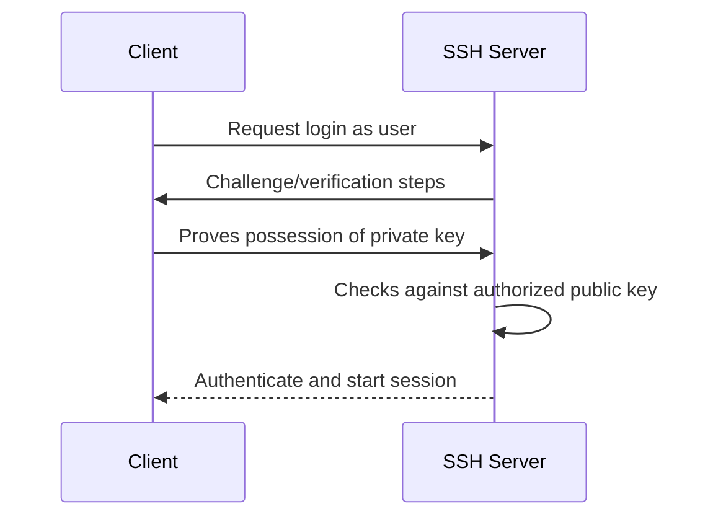

# SSH Public/Private Key Authentication

## 1. SSH vs OpenSSH

- **SSH** — the secure remote-access protocol.
- **OpenSSH** — a widely used implementation of the SSH protocol suite.

The basic client/server model is:

```text
client: ssh  --->  network  --->  server: sshd
```

## 2. Authentication methods in the notes

### Password authentication

A server can authenticate a user by checking the submitted password. Passwords are simple to use but can be guessed, reused, phished, or attacked by other means.

### Public-key authentication

A key pair consists of:

```text
private key  -> kept secret
public key   -> can be installed on the server
```

A useful mental model from the notes is **lock and key**: the public key is the part placed on the server, while the private key remains with the user.

## 3. Key authentication flow



The private key itself is not sent to the server. The client uses cryptographic operations to prove possession of the private key corresponding to a public key the server trusts.

## 4. Generate a key pair

Current OpenSSH `ssh-keygen` defaults to Ed25519 when no type is explicitly supplied on supported versions:

```bash
ssh-keygen
```

A commonly used explicit form is:

```bash
ssh-keygen -t ed25519
```

The resulting files typically include:

```text
~/.ssh/id_ed25519      private key
~/.ssh/id_ed25519.pub  public key
```

Older examples may use RSA:

```text
id_rsa
id_rsa.pub
```

## 5. Install the public key

A public key is normally added to:

```text
~/.ssh/authorized_keys
```

on the remote account. The private key stays on the client.

A convenient command when supported is:

```bash
ssh-copy-id username@host
```

## 6. Connect using a selected private key

```bash
ssh -i ~/.ssh/id_ed25519 username@host
```

Specify a non-default port with:

```bash
ssh -i ~/.ssh/id_ed25519 -p 2222 username@host
```

## 7. Important permissions

Private keys should not be readable by other users. A common secure mode is:

```bash
chmod 600 ~/.ssh/id_ed25519
```

The `.ssh` directory is commonly:

```bash
chmod 700 ~/.ssh
```
> **Verification status:** The commands and behavioral descriptions in this file were checked against current/official documentation where practical. Where a handwritten example differs from current behavior, the corrected behavior is stated explicitly so this file can be used independently.

