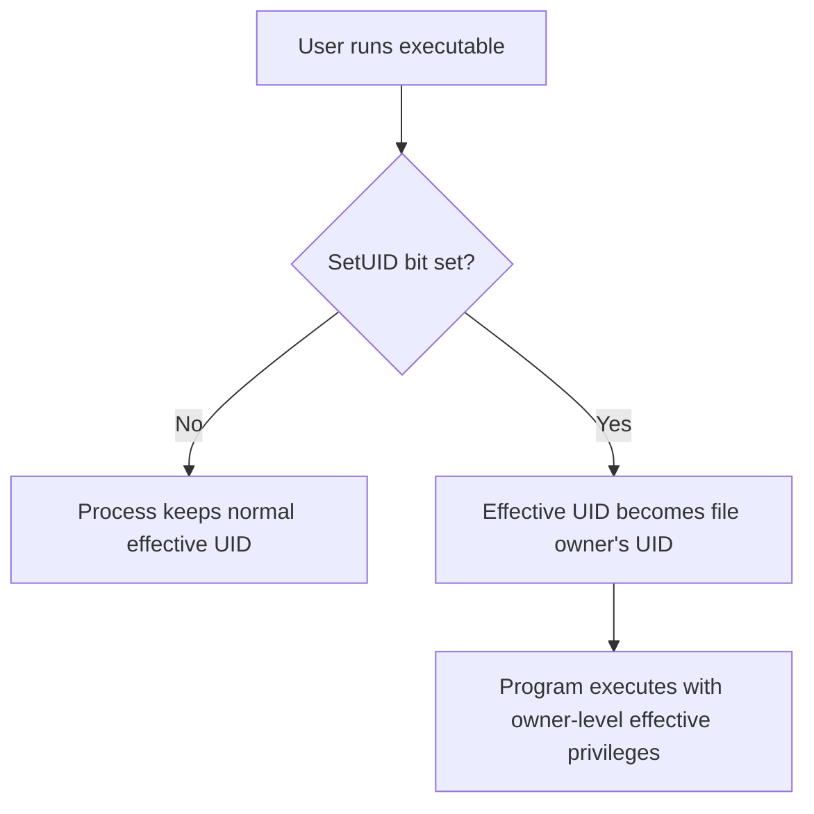

# Remote Commands and SetUID

## 1. Run one remote command with SSH

SSH does not require an interactive shell for every operation. A command can be supplied directly:

```bash
ssh username@server 'pwd'
ssh username@server 'ls -la'
```

With a non-default port:

```bash
ssh -p 2222 username@server 'ls -la'
```

Conceptual flow:

```text
local shell
   |
   | authenticate over SSH
   v
remote command executed
   |
   v
stdout/stderr returned
```

## 2. SetUID

**SetUID** is a file mode bit that, for a supported executable, causes the process's **effective user ID** to become the file owner's user ID when the program runs.

A typical root-owned SetUID program may look like:

```text
-rwsr-xr-x  root root  program
   ^
   s in the owner execute position
```

The `s` appears where the owner's `x` would normally be because the execute bit and setuid bit occupy related positions in the mode display.

## 3. Real UID vs effective UID

Conceptually:

```text
Real UID (RUID)       -> identity of the user who started the process
Effective UID (EUID)  -> identity used for permission checks by the process
```

A SetUID executable can therefore have an effective UID different from the real UID.

## 4. SetUID flow



The privilege applies to the program process and is governed by the kernel and other security controls. It does not magically turn every command typed by the user into root commands.

## 5. Setting and clearing SetUID

Symbolic:

```bash
chmod u+s program
chmod u-s program
```

Octal:

```bash
chmod 4755 program
```

The leading `4` represents setuid in the special-bit digit.

## 6. Finding SetUID files

A common search is:

```bash
find / -type f -perm -4000 2>/dev/null
```

This requests regular files with the setuid bit. Searching the whole filesystem may require privileges and can be slow.

## 7. Other special bits

```text
4 -> setuid
2 -> setgid
1 -> sticky bit
```

The notes call attention to security implications: a vulnerable privileged program can be dangerous because a bug may be reachable with elevated effective privileges. Whether an actual escalation is possible depends on the program, exploitability, kernel behavior, and system configuration.
> **Verification status:** The commands and behavioral descriptions in this file were checked against current/official documentation where practical. Where a handwritten example differs from current behavior, the corrected behavior is stated explicitly so this file can be used independently.

