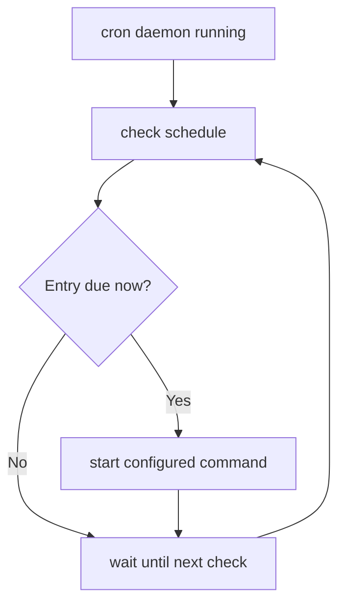

# Cron and `crontab`

## 1. What cron does

`cron` is a time-based job scheduler. A cron service/daemon runs in the background and checks scheduled entries so commands can execute at specified times.

## 2. `crontab`

A **crontab** is a table of scheduled jobs. Each entry combines a time specification with a command.

Example from the notes:

```cron
30 2 * * * /home/user/backup.sh
```

Meaning:

```text
minute       = 30
hour         = 2
month-day    = *  (every day of month)
month        = *  (every month)
weekday      = *  (every day of week)
command      = /home/user/backup.sh
```

### Visual field layout

```text
 ┌──── minute (0-59)
 │ ┌─── hour (0-23)
 │ │ ┌─ day of month (1-31)
 │ │ │ ┌ month (1-12)
 │ │ │ │ ┌ day of week (0-7, implementation convention)
 │ │ │ │ │
30 2 * * * /home/user/backup.sh
```

The five time fields normally appear before the command in a user crontab.

## 3. Common crontab commands

```bash
crontab -e   # edit the current user's crontab
crontab -l   # list the current user's crontab
crontab -r   # remove the current user's crontab
```

System-wide schedules can also exist in `/etc/crontab` and related system configuration directories. Their exact format and surrounding behavior can differ from a per-user crontab.

## 4. Cron scheduling examples

Every minute:

```cron
* * * * * /path/script.sh
```

Every day at 2:30:

```cron
30 2 * * * /path/script.sh
```

Every Monday at 08:00 (with the common weekday convention):

```cron
0 8 * * 1 /path/script.sh
```

## 5. Security/operations note

A cron job executes with the permissions of its configured user/account. Therefore scripts called by cron should be checked for safe paths, writable files, predictable environment, and appropriate permissions. Do not execute unknown scripts merely to “see what they do”; inspect them first in a safe, authorized environment.

## 6. Cron flow


> **Verification status:** The commands and behavioral descriptions in this file were checked against current/official documentation where practical. Where a handwritten example differs from current behavior, the corrected behavior is stated explicitly so this file can be used independently.

