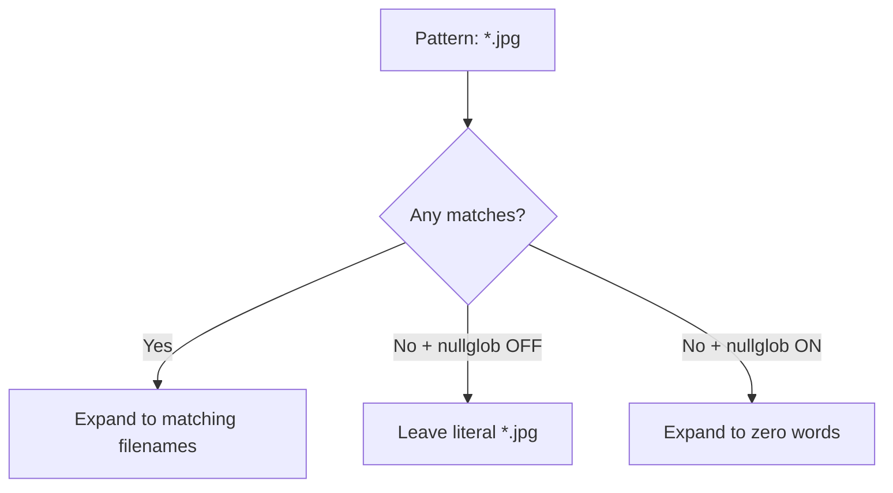

# Shell Globbing and `shopt`

## 1. Filename globbing

Bash expands wildcard patterns such as `*`, `?`, and bracket expressions before a command is executed.

Examples:

```bash
*.jpg
*.txt
file?.txt
[a-z].txt
```

`*` can match zero or more characters within a pathname component, subject to shell rules.

## 2. `shopt`

`shopt` controls Bash-specific shell options.

```bash
shopt -s nullglob
```

- `-s` enables an option.
- `-u` disables an option.

## 3. `nullglob`

Without `nullglob`, an unmatched glob can remain literal:

```bash
echo *.jpg
```

If no `.jpg` files exist, Bash can pass the literal `*.jpg` to `echo`.

With:

```bash
shopt -s nullglob
echo *.jpg
```

an unmatched `*.jpg` expands to **nothing**.

### Loop example

Suppose the directory contains no JPG files.

Potentially dangerous/incorrect pattern without `nullglob`:

```bash
for file in *.jpg; do
    rm "$file"
done
```

Without `nullglob`, the loop can run once with `file='*.jpg'`.

With:

```bash
shopt -s nullglob
for file in *.jpg; do
    rm -- "$file"
done
```

the word list is empty when there are no matches, so the loop executes zero times.

## 4. Other Bash options from the notes

### `dotglob`

```bash
shopt -s dotglob
```

Allows wildcard expansion to include hidden filenames (while Bash still has special rules for `.` and `..`).

### `failglob`

```bash
shopt -s failglob
```

Makes an unmatched pattern produce a shell expansion error instead of being passed literally.

### `extglob`

```bash
shopt -s extglob
```

Enables extended pattern forms such as:

```text
?(pattern-list)
*(pattern-list)
+(pattern-list)
@(pattern-list)
!(pattern-list)
```

## 5. Visual behavior



## 6. Safety habit

When using destructive commands with globs, preview the expansion first:

```bash
printf '%s\n' -- *.jpg
```

and then use a guarded loop when appropriate.
> **Verification status:** The commands and behavioral descriptions in this file were checked against current/official documentation where practical. Where a handwritten example differs from current behavior, the corrected behavior is stated explicitly so this file can be used independently.

