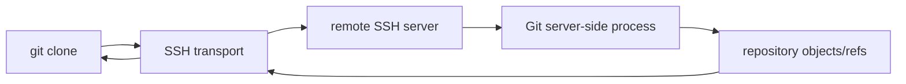

# Git Basics, Repositories, Remotes, and Cloning

## 1. What is a Git repository?

A Git repository is a working tree plus Git's metadata and object database. Running:

```bash
git init
```

in a directory creates a `.git` directory (unless using other repository layouts).

Example:

```text
project/
├── main.c
├── README.md
└── .git/
```

The `.git` area contains data used for history, references, configuration, the index, and the object database.

## 2. Remote repository

A remote repository is another Git repository referenced by your local repository so that history and commits can be exchanged.

Typical remote name:

```text
origin
```

## 3. HTTPS communication

Example clone form:

```bash
git clone https://github.com/user/project.git
```

The conceptual flow is:

```text
your Git
   |
   | HTTPS
   v
remote Git service
```

Modern Git hosting services commonly use token or other credential mechanisms rather than ordinary account passwords for HTTPS Git authentication.

## 4. SSH communication

Git also supports SSH URLs such as:

```bash
git clone ssh://user@example.com/path/to/repo.git
```

and the scp-like SSH syntax:

```bash
git clone user@example.com:/path/to/repo.git
```

Conceptual flow:



Git does not simply copy every working-tree file one by one; it exchanges Git repository data/objects through its transport protocol and then constructs the working tree locally.

## 5. What cloning creates

`git clone` creates a new local repository and configures a remote-tracking setup. After cloning, you commonly have:

```text
working tree
.git/
origin -> remote URL
origin/main -> remote-tracking reference (if main is the branch)
```

## 6. Basic workflow

```bash
git clone https://example.com/project.git
cd project

git status
```

Then changes can be staged and committed:

```bash
git add file.txt
git commit -m "Update file.txt"
```

The staging area is the bridge between the working tree and the next commit; it is not the mechanism by which `git push` decides which individual files to upload.
> **Verification status:** The commands and behavioral descriptions in this file were checked against current/official documentation where practical. Where a handwritten example differs from current behavior, the corrected behavior is stated explicitly so this file can be used independently.

