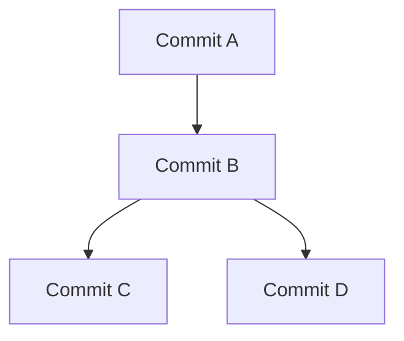

# Git Objects: Blob, Tree, Commit, and Tag

## 1. Git's object database

Git's core data model includes four object types:

```text
Git object database
├── blob
├── tree
├── commit
└── tag
```

These objects are referenced by cryptographic object IDs.

## 2. Blob

A **blob** stores file content.

Important idea:

```text
filename        -> stored by tree entry
file contents   -> stored in blob object
```

A blob does not by itself store the filename. If two files have exactly the same blob content, they can refer to the same blob object.

## 3. Tree

A **tree** represents a directory-like structure and stores entries that associate names and modes with other objects, usually blobs or subtrees.

Example working tree:

```text
project/
├── README.md
├── main.c
└── src/
    ├── logic.c
    └── user.c
```

Conceptual object relationships:

```text
README.md -> blob A
main.c    -> blob B
src/      -> tree C
logic.c   -> blob D
user.c    -> blob E
```

## 4. Commit

A commit points to one top-level tree and to zero or more parent commits, plus metadata such as author/committer information, timestamps, and the message.

```text
Commit
  |
  +--> root tree
         |
         +--> README.md -> blob
         +--> src/       -> tree
```

This is why it is more precise to say that a commit **points to a tree describing the snapshot**, rather than saying that the commit directly stores every file's bytes inline.

## 5. Commit history as a DAG



Branches are references that point at particular commits in this graph.

## 6. Root-tree example

```text
Project
├── README.md
└── src
    ├── login.c
    └── user.c

Commit
  |
  v
Root tree
  |
  +--> README.md -> Blob A
  |
  +--> src/      -> Tree B
                    |
                    +--> login.c -> Blob C
                    +--> user.c  -> Blob D
```

## 7. Immutability idea

Git objects are content-addressed and immutable after creation. If the content changes, the new content produces a different object ID.

Conceptually:

```text
content X
   |
   v
hash H1

content changed
   |
   v
hash H2
```

This lets Git use object IDs as stable names for stored repository data.

## 8. Hash example

For illustration:

```text
README.md
   |
   +--> blob object
          |
          +--> object ID / hash
```

The exact object ID depends on the object's type and content and on the repository's hash algorithm.
> **Verification status:** The commands and behavioral descriptions in this file were checked against current/official documentation where practical. Where a handwritten example differs from current behavior, the corrected behavior is stated explicitly so this file can be used independently.

