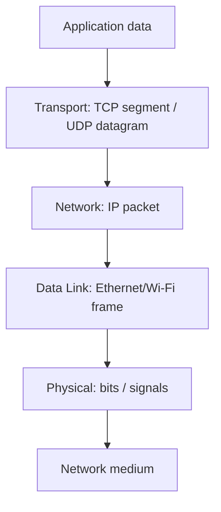

# OSI Model

## Detailed concepts, examples, and edge cases

Open Systems Interconnection; reference model for network interconnection; unique protocols at layers. Diagram/table maps applications/data, presentation, session, transport (segment/datagram), network (packet), data link (frame), physical (bits).

Layer 1: physical media/signals/cables/connectors; not protocols; fix cables, punch-downs, loopback/replacement tests. Layer 2: basic network language; Data Link/MAC; hardware address; switching based on MAC address.

Layer 2 decides the local-network destination; frames have header/payload/trailer; access rules for stored data; error detection. Security examples: fake ARP replies and MAC flooding can help interception.

Layer 3: network layer; delivers between networks; IP addresses. Functions: logical addressing, routing, packet forwarding from routing table, fragmentation, ICMP error reporting.

Layer 4 transport: end-to-end communication and ports; segmentation; TCP reliability, order, retransmission, duplicate detection, error recovery, flow/congestion control.

Layer 5 session: establish/manage/terminate sessions; session hijacking example. Layer 6 presentation: translation, encryption/decryption, compression/decompression, formatting.

Layer 7 application; protocols such as HTTP/HTTPS, DNS, FTP, SSH, SMTP, POP3. Web/application attacks listed: SQL injection, XSS, brute force, phishing, DoS. In the TCP/IP model, the OSI upper-layer functions are commonly grouped into the application layer.

## Complete layer-by-layer guide

The OSI model is a seven-layer reference model. It is useful because it gives a common vocabulary for troubleshooting and describing where a protocol or device operates. Real-world protocol stacks do not map perfectly one-to-one to OSI layers; the mapping below is therefore a practical study model, not a claim that each protocol exists only at one layer.

### Layer 7 — Application
Provides network services directly used by applications. Examples include HTTP/HTTPS for web access, DNS for naming, SMTP/IMAP/POP for email, FTP/SFTP for file transfer, SSH for remote administration, and DHCP for host configuration. Application-layer attacks can target the application itself, such as SQL injection, cross-site scripting, credential attacks, phishing, and application-level denial of service.

### Layer 6 — Presentation
Responsible conceptually for how application data is represented. Typical functions include data-format conversion, character-set/serialization conversion, compression/decompression, and encryption/decryption. In modern TCP/IP stacks these functions are usually implemented by application libraries and protocols rather than a separate presentation-layer protocol.

### Layer 5 — Session
Conceptually manages communication sessions: establishment, maintenance, coordination and termination. Session concepts help explain authentication sessions, dialogs, checkpoints, and session hijacking. Modern protocols often combine session functions with application or transport mechanisms rather than implementing a dedicated OSI Session Layer.

### Layer 4 — Transport
Provides process-to-process delivery. Port numbers identify application endpoints, and transport protocols can provide segmentation, multiplexing, reliability, retransmission, flow control and congestion control.

**TCP:** connection-oriented, reliable, ordered byte stream, sequence/acknowledgment based, retransmission, flow control and congestion control.

**UDP:** connectionless datagrams with minimal protocol overhead; no built-in guarantee of ordered delivery or retransmission.

### Layer 3 — Network
Provides logical addressing and delivery between networks. IPv4 and IPv6 are the primary examples. Routers use Layer 3 information to select the next hop. Related functions include routing, forwarding, TTL/Hop Limit processing, ICMP error/control messages and (for IPv4) fragmentation.

### Layer 2 — Data Link
Provides communication over a local link or LAN segment. Ethernet frames contain Layer 2 addressing information such as source and destination MAC addresses. Switches learn MAC addresses and forward frames using their forwarding database. Layer 2 also includes media-access rules and link-level error detection such as the Ethernet FCS.

### Layer 1 — Physical
Carries raw bits as electrical, optical or radio signals. This includes copper/fiber media, connectors, pinouts, signaling, modulation, frequencies and physical transceivers.

## Encapsulation and decapsulation

When an application sends data, each lower layer adds information needed by the next stage. A simplified Ethernet/IPv4/TCP example is:

```text
Application data
      ↓
TCP segment (TCP header + data)
      ↓
IP packet (IP header + TCP segment)
      ↓
Ethernet frame (Ethernet header + IP packet + FCS)
      ↓
Physical bits/signals
```

At the destination the process is reversed: the receiver validates and removes each layer's encapsulation until the application receives the original payload.

## Device/protocol study map

| Layer | Common examples | Data unit | Typical device/function |
|---|---|---|---|
| 7 | HTTP, DNS, SMTP, SSH | Data | Application/service |
| 6 | Encoding, compression, encryption functions | Data | Usually implemented in software |
| 5 | Session management concepts | Data | Usually implemented in software |
| 4 | TCP, UDP | Segment / datagram | Host transport stack |
| 3 | IPv4, IPv6, ICMP | Packet | Router / Layer-3 switch |
| 2 | Ethernet, Wi-Fi, ARP | Frame | Switch / NIC / access point |
| 1 | Copper, fiber, RF, connectors | Bits | Cables / transceivers / radio |

## Troubleshooting with OSI

Start at the lowest layer that can explain the symptom and move upward: verify power/cabling/link, then local switching, IP addressing/default gateway, routing, transport ports, and finally the application/service. A failure at a lower layer can prevent every higher layer from functioning.

## Security concepts carried by the model

- **ARP spoofing/poisoning:** manipulates IPv4-to-MAC associations on a local broadcast domain.
- **MAC flooding:** attempts to overwhelm a switch's MAC-learning table so unknown unicast traffic may be flooded.
- **Session hijacking:** attempts to take over an already-established application session.
- **Application attacks:** target application parsing, authentication, authorization or business logic.

## Encapsulation diagram


## Verification references

The links below document the verification basis for this file and are optional for study.

- [Professor Messer — CompTIA N10-009 Network+ course](https://www.professormesser.com/network-plus/n10-009/n10-009-video/n10-009-training-course/)
