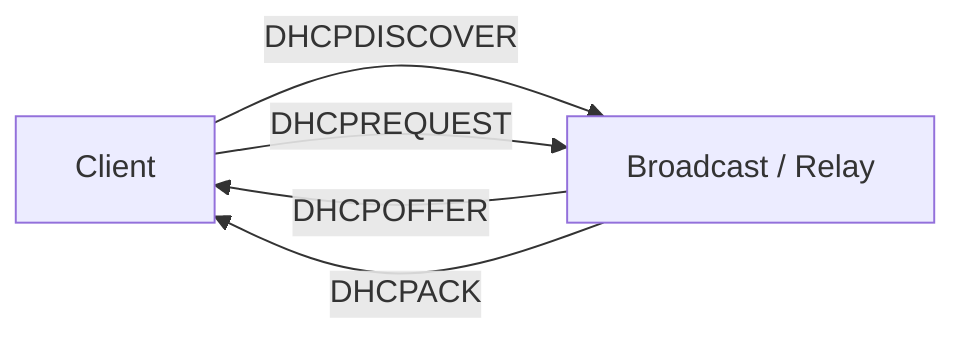

# IP, ARP, DHCP and Core Protocols

## Detailed concepts, examples, and edge cases

IPv4 packet loop protection: packet dropped after hop limit; each router traversal is a hop. Example router hop count. 'Time to lookup' differs by context: router hop/route metric vs DNS time-to-live. DNS resolves names to IPs and caches results for a period.

dig example for a domain shows A record, TTL and answer IP; query time; DNS server 8.8.8.8#53 over UDP. A = IPv4 address record; IN = Internet class; server is the resolver that answered.

Subnetting splits a network into smaller networks. Network address identifies the subnet; host address identifies a device. Default gateway is usually router address used to reach outside networks. Example 192.168.151.168, gateway .1 or .254; subnetting can separate departments.

ARP = Address Resolution Protocol; request broadcast asks which MAC owns an IP, reply returns MAC. DHCP automatically assigns IP configuration using DORA (Discover, Offer, Request, ACK).

## IPv4 packet forwarding and TTL
Every IPv4 packet has a TTL field. Each router that forwards a packet decrements the TTL; when the value reaches zero, the router discards the packet and may send ICMP Time Exceeded. This limits the lifetime of packets caught in routing loops.

A simplified forwarding process is:

```text
Receive IP packet
      ↓
Check destination IP
      ↓
Look up routing table
      ↓
Choose most-specific matching route
      ↓
Decrement TTL / update header checks
      ↓
Forward to next hop
```

Do not confuse IPv4 TTL with DNS record TTL. IPv4 TTL limits packet lifetime in hops; DNS TTL controls cache lifetime in seconds.

## ARP — Address Resolution Protocol
ARP resolves an IPv4 address to a MAC address on the local Layer-2 network. A host normally needs the destination MAC when sending an IPv4 packet directly to another device on the same subnet, or the MAC of the default gateway when the final destination is on another subnet.

**ARP request:** broadcast within the local broadcast domain asking which host owns a specified IPv4 address.

**ARP reply:** the owner returns its MAC address, typically as a unicast reply. The sender caches the mapping for a limited time.

### ARP example
Host A: `192.168.1.10/24` wants to contact `192.168.1.20`.

```text
Host A → Ethernet broadcast:
"Who has 192.168.1.20? Tell 192.168.1.10"

Host B → Host A:
"192.168.1.20 is at <B's-MAC>"
```

If the destination were `192.168.2.20`, Host A would instead resolve the MAC address of its default gateway (for example `192.168.1.1`) and send the packet to the router.

## DHCPv4
DHCP automatically supplies IPv4 configuration such as an address, subnet mask, default gateway, DNS servers and lease duration. It is a client/server protocol and normally uses UDP/67 on the server and UDP/68 on the client.

### DORA

```text
Client                          DHCP Server
  | -------- DISCOVER --------> |
  | <--------- OFFER ---------- |
  | --------- REQUEST --------> |
  | <-------- ACK ------------- |
```

A DHCP relay agent allows a DHCP server to serve clients on another IP subnet, so a dedicated DHCP server does not have to exist on every subnet.

### Lease lifecycle
A DHCP address is normally leased for a defined duration. The client attempts to renew the lease before it expires. If renewal with the preferred/original server fails, the client may later attempt rebinding through other DHCP infrastructure according to the protocol state machine. The exact timing is governed by DHCP lease timers.

## Subnetting foundations

- **Network address:** identifies the subnet.
- **Host address:** identifies an interface/device within that subnet.
- **Broadcast address (IPv4):** address for all hosts in the subnet; not usable as a normal host address.
- **Default gateway:** local router address used to reach destinations outside the subnet.

A subnet mask defines which bits belong to the network prefix and which bits are available for hosts.

### Example
For `192.168.1.10/24`:

- Mask = `255.255.255.0`
- Network = `192.168.1.0`
- Usable host range = `192.168.1.1`–`192.168.1.254`
- Broadcast = `192.168.1.255`

The `/24` means the first 24 bits are the network prefix and 8 bits remain for host addressing.

## `dig` DNS troubleshooting example
`dig` is a DNS query tool. A typical query such as:

```bash
dig www.example.com
```

shows the query name/type, answer records, TTL, query time and the resolver/server that replied. An `A` record maps a hostname to an IPv4 address. `dig -x <IP>` performs a reverse DNS lookup for a PTR record.

## Key distinction: address resolution vs naming

- **ARP:** IPv4 address → local MAC address.
- **DNS:** human-readable name → resource record(s), often an IP address.
- **DHCP:** supplies host configuration, including addresses and options.

## DHCP DORA flow


## ARP flow
```text
IPv4 destination known?
   ├─ same subnet → ARP for destination MAC
   └─ remote subnet → ARP for default-gateway MAC
```

## Verification references

The links below document the verification basis for this file and are optional for study.

- [IETF RFC 2131 — DHCP](https://www.rfc-editor.org/rfc/rfc2131)
- [IETF RFC 1034 — DNS Concepts and Facilities](https://www.rfc-editor.org/rfc/rfc1034)
- [IETF RFC 1035 — DNS Implementation and Specification](https://www.rfc-editor.org/rfc/rfc1035)
