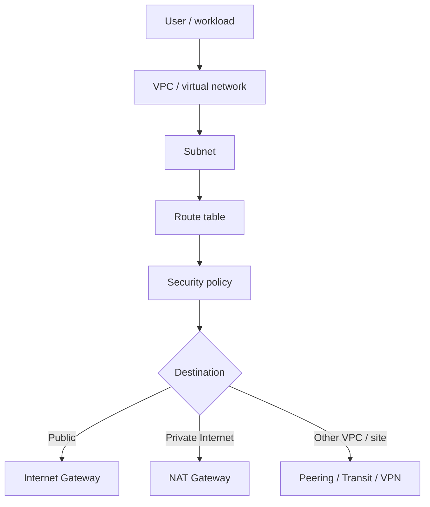

# Cloud, Virtual Networking and VPCs

## Detailed concepts, examples, and edge cases

Cloud design: on-demand computing; elasticity; scalable applications and remote access; multitenancy allows many clients to share infrastructure efficiently. Virtual network concept gives isolated/private LAN-like environments inside cloud infrastructure.

NFV replaces physical network appliances with virtual versions via a hypervisor; routing/switching/load balancing can be deployed as software. VPCs create isolated virtual networks and can use transit gateways/cloud routers.

VPC connectivity: site-to-site VPN, VPC internet gateway, VPC NAT gateway, VPC endpoints. VPC endpoint gives private access to cloud services. Diagram shows private subnets/VMs and cloud storage/network paths.

Cloud security groups: control inbound/outbound traffic using TCP/UDP ports and Layer-3 IP address ranges. Network security lists apply subnet-level rules; notes compare their customization and scope.

Cloud deployment models: public, private, hybrid (public + private). SaaS: on-demand software, data may live in third-party cloud, little local install. IaaS: provider supplies infrastructure while customer manages OS/software/security.

PaaS: provider handles infrastructure/platform while customer focuses on application development; no server/OS maintenance by customer, but less direct control. The developer works with the capabilities exposed by the managed platform.

## Cloud characteristics
Cloud networking commonly emphasizes:

1. **On-demand resource allocation** — compute, storage and network resources can be provisioned when needed.
2. **Elasticity** — resources can scale up or down with demand.
3. **Measured usage** — consumption can be monitored and billed by use or allocation.
4. **Multitenancy** — multiple customers share provider infrastructure with logical isolation.
5. **Broad network access** — resources can be accessed from many locations and device types when permitted.

## Virtual networking
A virtual network creates logical networks and network interfaces in software. Virtual machines, containers and cloud workloads can each receive virtual interfaces and addresses while physical switches and routers provide the underlying transport.

### NFV — Network Functions Virtualization
NFV moves network functions from dedicated appliances into software workloads, often running on commodity servers or virtualized infrastructure. Examples include virtual routers, virtual firewalls, virtual load balancers and VPN gateways.

NFV is about **how a network function is implemented**. Software-defined networking (SDN) is a broader control/management architecture that can separate forwarding from centralized policy/control.

## VPC — Virtual Private Cloud
A VPC is a logically isolated virtual network inside a cloud environment. A typical design includes:

- a CIDR address range;
- multiple subnets;
- route tables;
- internet connectivity through an Internet Gateway or equivalent;
- private outbound connectivity through NAT gateways/instances where appropriate;
- security groups/firewall policies;
- private service endpoints or endpoint gateways;
- connectivity to other VPCs/networks through transit gateways, peering or VPNs.

### Typical VPC traffic pattern

```text
Private subnet workload
        |
        | route table
        v
   NAT gateway  ----> Internet

Public subnet workload
        |
        v
Internet gateway ----> Internet

VPC A ---- transit/peering/VPN ---- VPC B
```

## Internet gateway vs NAT gateway
An **Internet Gateway** is the cloud construct that provides Internet connectivity for resources whose routing/public-address configuration permits it. A **NAT Gateway** commonly provides outbound Internet connectivity for private-subnet resources without making those resources directly reachable from the Internet.

NAT does not automatically make a network secure. Security groups, network ACLs, routing and application controls still matter.

## VPC security groups and network security lists
Cloud platforms use different names and exact behaviors; the general conceptual distinction is:

- **Security group:** policy associated with a resource/network interface. On many platforms it is stateful, meaning return traffic is automatically permitted for an allowed connection.
- **Network ACL/security list:** policy associated with a subnet/network boundary. It is commonly broader in scope and may be stateless, so both directions can need explicit rules.

Always verify the behavior of the specific cloud provider/product because terminology and rule processing differ.

## Cloud service models

### SaaS — Software as a Service
The provider delivers the application. The customer primarily manages users, data, configuration and business use; the provider manages the application platform and infrastructure.

### IaaS — Infrastructure as a Service
The provider supplies virtualized compute, storage and networking. The customer generally manages the operating system, installed software, configuration and data.

### PaaS — Platform as a Service
The provider manages infrastructure and a managed application/runtime platform. The customer focuses on application code, configuration and data while giving up direct control over much of the underlying platform.

## Shared-responsibility principle
Cloud security is divided between provider and customer. The provider secures the cloud infrastructure; the customer is responsible for the portions of identity, data, workloads, operating systems, networking and configuration assigned by the service model. The exact boundary varies by service.

## Cloud network flow


## Verification references

The links below document the verification basis for this file and are optional for study.

- [NIST SP 800-207 — Zero Trust Architecture](https://csrc.nist.gov/pubs/sp/800/207/final)
