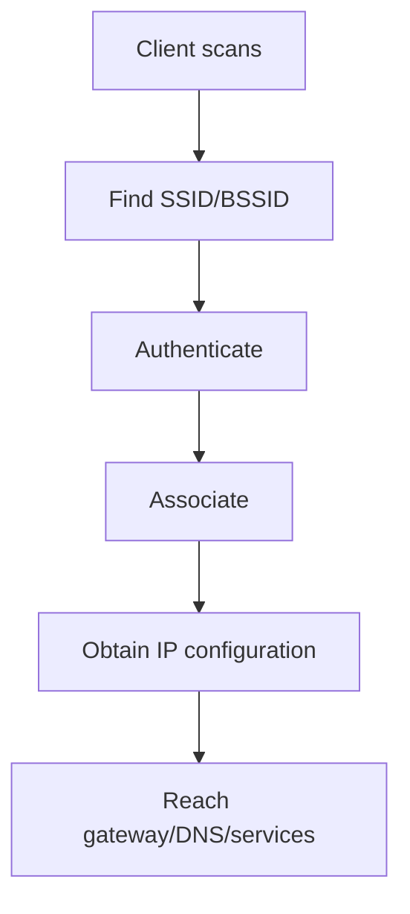

# Wireless Networking and Cellular Technologies

## Detailed concepts, examples, and edge cases

Wireless networking standards under IEEE 802.11/Wi-Fi. 4G/LTE all-IP cellular technology; LTE-Advanced. 5G around 2020, higher frequencies/capacity and major IoT impact.

Satellite networking: useful for remote/non-terrestrial networks; higher cost and latency than terrestrial; requires direct line of sight. GEO propagation can be ~250 ms one-way, making RTT typically ~500 ms+ before processing/queueing.

## Wireless LAN standards
IEEE 802.11 defines the Wi-Fi family of WLAN technologies. The Wi-Fi Alliance certifies interoperability profiles and markets generations such as Wi-Fi 6/6E and Wi-Fi 7.

### Frequency bands
Common Wi-Fi bands include:

- **2.4 GHz:** longer range and better wall penetration, but fewer non-overlapping channels and more interference.
- **5 GHz:** more available channels and generally higher capacity, with somewhat shorter propagation range.
- **6 GHz:** additional spectrum for newer Wi-Fi generations where supported by regulation and devices; requires compatible clients/APs and has different range/propagation characteristics from 2.4 GHz.

## Channels
A wireless channel is a portion of the available RF spectrum. Channel width affects capacity and channel overlap. Using wider channels can increase potential throughput but consumes more spectrum and may increase interference or reduce the number of independent channels available.

## Bandwidth
Channel width may be expressed as 20, 40, 80, 160 MHz, etc. Actual throughput is less than the nominal PHY rate because of protocol overhead, contention, signal conditions, retransmissions and other factors.

## Band steering
Band steering is a controller/AP feature that attempts to encourage capable clients toward a more suitable band, often 5 or 6 GHz instead of congested 2.4 GHz. It is an optimization, not a standards-mandated guarantee; clients ultimately control many aspects of association.

## Cellular networking

### 4G / LTE
LTE is a 4G cellular technology family. LTE Advanced (LTE-A) added capabilities such as carrier aggregation and higher peak throughput compared with early LTE.

### 5G
5G introduces new radio technologies, spectrum options and network architectures. Depending on the deployment, it can offer higher capacity, lower latency and support for large IoT/device densities compared with previous generations.

### Satellite networking
Satellite links are useful for remote locations where terrestrial infrastructure is limited. Trade-offs include higher propagation delay for many satellite orbits, weather/coverage considerations depending on band/system, and specialized antennas/terminals. Geostationary systems have much higher latency than low-earth-orbit constellations because the signal travels a much longer path.

## Wireless association path

## Verification references

The links below document the verification basis for this file and are optional for study.

- [Professor Messer — CompTIA N10-009 Network+ course](https://www.professormesser.com/network-plus/n10-009/n10-009-video/n10-009-training-course/)
