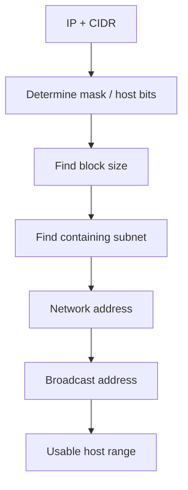

# IPv4 Addressing and Subnetting

## Detailed concepts, examples, and edge cases

IPv4 address example, subnet mask 255.255.255.0 (/24). Default gateway lets hosts reach outside networks. Loopback 127.0.0.1 and loopback block 127/8. Reserved 240/4 is legacy Class E space and not ordinary host addressing.

DHCP = Dynamic Host Configuration Protocol. APIPA is automatic private IPv4/link-local addressing when DHCP is unavailable, in 169.254.0.0/16; not routed externally; ARP helps find peers. IPv4 has scaling limitations as device counts grow; private addresses + NAT extend usability.

Classful subnet masks: Class A 255.0.0.0, B 255.255.0.0, C 255.255.255.0. CIDR/Classless Inter-Domain Routing expresses masks as prefixes such as 255.0.0.0 /8; example 192.168.1.155/24.

Subnet mask: consecutive 1s on left and 0s on right; tells the network boundary. Example 192.168.1.10/24 has subnet 192.168.1.0. Any host address on that subnet shares the same network portion. Binary mask example illustrates /12 boundary.

Subnetting use cases: create local networks with default gateways, reduce broadcast/ARP congestion and limit broadcast scope. Diagram shows separate /24 subnets. VLSM allows different mask sizes based on need.

VLSM example using 10.0.0.0/16 and smaller subnets. Example shows dividing address space in stages and using different prefix lengths for different departments/consumers. Private addresses are used internally and NAT/public gateway may provide outside access.

Further subnetting: each additional subnet bit reduces address space per subnet; eventually you approach /32 where no further host bits remain. Magic-number table for quickly calculating masks/subnet ranges.

## IPv4 addressing
IPv4 addresses are 32 bits, normally written as four decimal octets. A subnet prefix defines the network portion; the remaining bits identify host addresses within the subnet.

### CIDR notation
`192.168.1.0/24` means the first 24 bits are the network prefix and 8 bits are host bits. CIDR replaced rigid class-based boundaries and allows flexible prefix lengths.

## Subnet masks
A subnet mask written in dotted decimal corresponds to the CIDR prefix length.

Examples:

| CIDR | Mask | Host bits | Addresses |
|---|---|---:|---:|
| /24 | 255.255.255.0 | 8 | 256 |
| /25 | 255.255.255.128 | 7 | 128 |
| /26 | 255.255.255.192 | 6 | 64 |
| /27 | 255.255.255.224 | 5 | 32 |
| /28 | 255.255.255.240 | 4 | 16 |
| /29 | 255.255.255.248 | 3 | 8 |
| /30 | 255.255.255.252 | 2 | 4 |

For a traditional IPv4 subnet with ordinary host addressing, the first address is the network address and the last is the broadcast address, so usable hosts are normally `2^hostbits - 2`. Point-to-point and special-purpose designs can use different conventions such as RFC 3021 /31 addressing.

## Subnet-mask bit pattern
A valid IPv4 subnet mask contains a contiguous run of 1-bits followed by 0-bits. For example:

```text
255.255.255.0
11111111.11111111.11111111.00000000
```

A pattern with 1s after a 0 in the middle is not a valid conventional subnet mask.

## Finding network and broadcast addresses
For an address and mask, a bitwise AND gives the network address. The broadcast address is the network address with all host bits set to 1.

Example: `192.168.1.70/26`

- /26 → blocks of 64 addresses.
- Subnet blocks: 0–63, 64–127, 128–191, 192–255.
- 70 belongs to the 64–127 block.
- Network = `192.168.1.64`.
- Broadcast = `192.168.1.127`.
- Usable = `192.168.1.65`–`192.168.1.126`.

## Subnetting
Subnetting divides one larger network into smaller networks/broadcast domains. Benefits include smaller broadcast domains, more controlled addressing, segmentation and more efficient routing design.

If `n` host bits are borrowed for subnetting, the number of equal-size subnets is `2^n`. The host capacity in each subnet depends on the remaining host bits.

## VLSM — Variable Length Subnet Masking
VLSM lets different subnets use different prefix lengths. It avoids wasting addresses when departments have different host requirements.

Example with a larger private block:

```text
10.0.0.0/16
├── /24 for ~254 hosts
├── /25 for ~126 hosts
├── /26 for ~62 hosts
└── /28 for ~14 hosts
```

The actual allocation should place larger networks first and choose non-overlapping ranges.

## Classful vs classless addressing
Old classful defaults:

- Class A → /8
- Class B → /16
- Class C → /24

Modern IP networks use CIDR and do not require classful boundaries. The old class labels remain useful for historical context, but they are not how modern Internet routing is designed.

## Binary shortcut
When solving subnetting questions, memorize the last-octet block sizes:

`128, 64, 32, 16, 8, 4, 2, 1`

A `/25` has blocks of 128, `/26` has 64, `/27` has 32, `/28` has 16, etc. The network boundary is the first multiple of the block size that is not greater than the address's relevant octet.

## Subnet calculation flow


## Verification references

The links below document the verification basis for this file and are optional for study.

- [Professor Messer — CompTIA N10-009 Network+ course](https://www.professormesser.com/network-plus/n10-009/n10-009-video/n10-009-training-course/)
