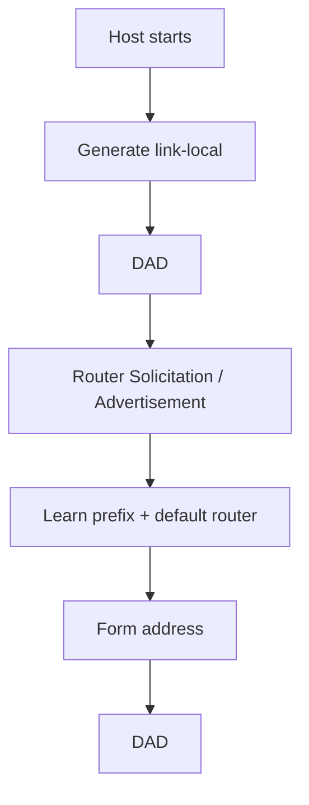

# IPv6, Transition, NDP and SLAAC

## Detailed concepts, examples, and edge cases

IPv4 limitation vs IPv6. IPv4 32-bit address space; NAT widely used. IPv6 uses 128-bit addresses and hex notation. Leading zeros omitted; one `::` can compress a single run of zero groups.

IPv6/IPv4 transition: tunneling mechanisms such as 6to4/ISATAP and dual-stack operation; NAT64/translation can translate between IPv6 and IPv4 where supported. Notes contrast transition choices.

## IPv6 basics
IPv6 uses 128-bit addresses, written as eight groups of hexadecimal values separated by colons. It was designed to provide a vastly larger address space and a cleaner base header than IPv4.

Example:

`2001:db8:1234:5678::1`

`2001:db8::/32` is reserved for documentation examples.

## Address compression
IPv6 notation allows leading zero suppression within each 16-bit group and allows one contiguous run of all-zero groups to be replaced by `::`.

Example:

`2001:0db8:0000:0000:0000:0000:0000:0001`

becomes:

`2001:db8::1`

`::` may appear only once because otherwise the number of omitted zero groups would be ambiguous.

## Important IPv6 address types

- **Global unicast:** globally routable unicast addresses.
- **Link-local:** `fe80::/10`; used for communication on the local link and essential for Neighbor Discovery and many IPv6 control functions.
- **Unique local address (ULA):** `fc00::/7`, commonly using the `fd00::/8` subset for locally assigned prefixes.
- **Multicast:** `ff00::/8`; one-to-many delivery.
- **Anycast:** same address assigned to multiple interfaces; traffic reaches one appropriate member of the anycast set.
- IPv6 has **no broadcast address**; multicast fulfills the broadcast-like functions.

## IPv6 header and Hop Limit
IPv6 has a fixed 40-byte base header. It uses **Hop Limit** rather than IPv4 TTL. Routers decrement Hop Limit on forwarding; when it reaches zero, the packet is discarded and ICMPv6 Time Exceeded may be generated.

IPv6 moves optional information into extension headers instead of placing a large collection of options into the base header.

## Neighbor Discovery Protocol (NDP)
NDP replaces the IPv4 ARP model with ICMPv6 messages and performs several functions:

- Neighbor Solicitation (NS) and Neighbor Advertisement (NA) for neighbor resolution and reachability;
- Router Solicitation (RS) and Router Advertisement (RA) for discovering routers and prefixes;
- Duplicate Address Detection (DAD);
- Redirects in appropriate cases.

## SLAAC
Stateless Address Autoconfiguration allows a host to generate IPv6 addresses using local information plus prefixes advertised by routers.

```text
Host starts
   ↓
Create link-local address
   ↓
Run Duplicate Address Detection
   ↓
Receive Router Advertisement
   ↓
Learn prefix/default-router information
   ↓
Form usable IPv6 address
   ↓
Run DAD for the new address
```

SLAAC does not require a DHCPv6 server to allocate the address. DHCPv6 can still be used simultaneously for additional information or stateful address management when the network requires it.

## DAD
Duplicate Address Detection checks whether an address is already in use on the local link before the host uses it normally. This is part of IPv6 autoconfiguration and is performed for addresses configured by SLAAC and DHCPv6.

## Stateless DHCPv6 and stateful DHCPv6
Router Advertisements contain flags that influence how hosts obtain configuration. A deployment can use SLAAC alone, SLAAC plus stateless DHCPv6 for additional configuration, or DHCPv6 for stateful addressing/configuration depending on requirements.

## IPv4-to-IPv6 transition ideas
The information includes dual stack, tunneling, translation and 6to4.

- **Dual stack:** run IPv4 and IPv6 simultaneously.
- **Tunneling:** carry one IP version through an infrastructure that primarily supports another.
- **Translation:** translate between IPv4 and IPv6 traffic when endpoints do not share an IP version.
- **6to4:** a historical automatic tunneling mechanism; it is deprecated and should not be treated as a modern deployment recommendation.

## SLAAC flow


## Verified / corrected technical details

- IPv6 uses 128-bit addresses and has no broadcast address; multicast replaces broadcast-style discovery in IPv6.
- 6to4 is a historical transition mechanism and is not a current recommendation; dual stack, configured/automatic tunneling where appropriate, and translation mechanisms are the modern conceptual categories.
- IPv6 SLAAC includes Duplicate Address Detection and learns routing/prefix information through Router Advertisements.

## Verification references

The links below document the verification basis for this file and are optional for study.

- [IETF RFC 8200 — IPv6](https://www.rfc-editor.org/rfc/rfc8200)
- [IETF RFC 4861 — IPv6 Neighbor Discovery](https://www.rfc-editor.org/rfc/rfc4861)
- [IETF RFC 4862 — IPv6 SLAAC](https://www.rfc-editor.org/rfc/rfc4862)
