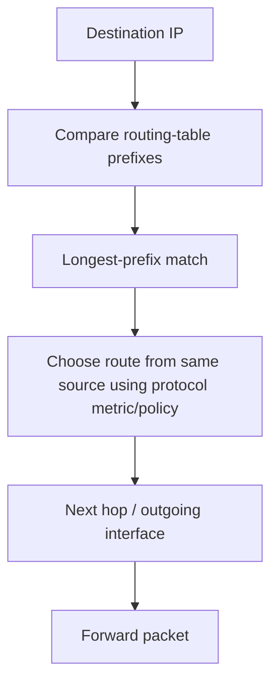

# Routing, Static Routing and First-Hop Redundancy

## Detailed concepts, examples, and edge cases

Static routing: when destination is in table, forward according to route; otherwise use default route if present, else discard. Pros: control, low overhead, simple on small networks. Cons: hard to maintain at scale, no automatic convergence.

Routing techniques: build routing tables using directly connected/static/dynamic routes. Metrics differ by routing protocol. Example RIP-style route entry with destination, metric/hop count, next hop, timer/sequence information.

First Hop Redundancy Protocols: virtual IP/default gateway shared by multiple routers; another router becomes active if the current gateway fails. HSRP is an example of a first-hop redundancy protocol using a virtual IP/default gateway.

## What a routing table does
A routing table maps destination prefixes to next hops and/or outgoing interfaces. A router compares the destination IP against its routes and selects the most specific matching prefix. If multiple routes to the same prefix come from the same source, the routing protocol's metric/policy decides; if they come from different sources, the platform may use an administrative preference such as administrative distance.

## Building a route
Routes may come from:

- directly connected networks;
- static routes configured by an administrator;
- dynamic routing protocols;
- a default route (`0.0.0.0/0` in IPv4, `::/0` in IPv6).

## Static routing
Static routes are deterministic and simple in small/stable environments. They do not exchange routing updates, so they add little protocol traffic. Their limitation is operational: topology changes require manual updates unless automation changes the configuration.

## Dynamic routing
Dynamic routing protocols exchange reachability information and adapt to topology changes. Main families:

### Distance vector
Routers learn routes from neighbors and use a route metric to choose paths. RIP is the classic example; its metric is hop count and its maximum finite metric is 15 hops.

### Link state
Routers build a view of the topology and independently calculate shortest paths. OSPF is a common example. Each router maintains a link-state database and computes a shortest-path tree.

### Path vector
BGP is the standard path-vector inter-domain protocol. It exchanges network reachability plus path attributes such as AS_PATH and applies routing policy between autonomous systems.

## Routing metrics
Examples of routing metrics include hop count, bandwidth/cost, delay, reliability and policy attributes. There is no universal metric across all protocols.

## Route selection example
Suppose a router has:

```text
10.0.0.0/8      via Router A
10.10.0.0/16    via Router B
10.10.20.0/24   via Router C
```

A packet for `10.10.20.25` matches all three prefixes, but `/24` is the most specific and therefore wins the longest-prefix match.

## FHRP
First Hop Redundancy Protocols provide a highly available default gateway by presenting a shared virtual IP/MAC or equivalent logical gateway to hosts. A failure can trigger another router to assume gateway responsibility.

## Routing loops
Loops can cause packets to circulate until TTL/Hop Limit expires. Dynamic routing protocols include loop-prevention mechanisms such as split horizon/route poisoning in distance-vector designs, topology databases in link-state designs, and AS-path checks in BGP.

## Troubleshooting commands
Common tools include:

```bash
ip route
ip -6 route
traceroute example.com
traceroute -6 example.com
```

Windows equivalents include `route print` and `tracert`. A traceroute is useful because each responding hop helps reveal where forwarding stops or becomes slow, although filtering can prevent responses from some routers.

## Route selection flow


## Verification references

The links below document the verification basis for this file and are optional for study.

- [IETF RFC 2328 — OSPFv2](https://www.rfc-editor.org/rfc/rfc2328)
- [IETF RFC 2453 — RIP v2](https://www.rfc-editor.org/rfc/rfc2453)
- [IETF RFC 4271 — BGP-4](https://www.rfc-editor.org/rfc/rfc4271)
