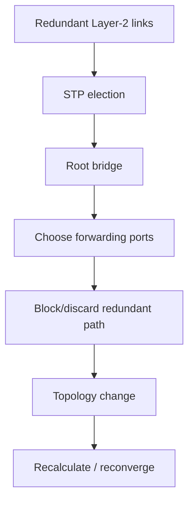

# Spanning Tree, Switch Security and Layer-2 Threats

## Detailed concepts, examples, and edge cases

STP: prevents switching loops. Redundant links can create frames circulating forever. STP uses states to block/learn/forward; classic states shown. IEEE 802.1D prevents loops and can reconverge after failures.

## Why Spanning Tree exists
Redundant Layer-2 links are useful for availability, but Ethernet has no built-in mechanism for safely routing a frame through multiple redundant paths. A loop can cause repeated broadcasts, duplicate frames and MAC-table instability.

Spanning Tree Protocol (STP) prevents loops by placing some redundant ports into a non-forwarding state while keeping the topology available as a backup.

## STP port states (traditional terminology)

- **Blocking:** does not forward data frames; receives relevant control information.
- **Listening:** participates in STP calculations but does not learn MAC addresses or forward data.
- **Learning:** learns source MAC addresses but does not yet forward user traffic.
- **Forwarding:** forwards data and learns MAC addresses.
- **Disabled:** administratively unavailable.

Modern implementations may use different state terminology internally. RSTP (802.1w) simplifies convergence using roles/states such as discarding, learning and forwarding.

## STP root bridge
STP elects a root bridge. The election is based on the lowest Bridge ID, which combines bridge priority and MAC-address-related information. Switches calculate the best path toward the root and select appropriate root/designated ports.

```text
              Root Bridge
              [Switch 1]
              /                Designated   Designated
          /                   [Switch 2] ----- [Switch 3]
          \             /
           \--- backup -/
```

One of the redundant links may be placed into a non-forwarding state until a topology change requires it.

## RSTP
Rapid Spanning Tree Protocol reduces convergence time compared with classic 802.1D STP by using a more efficient state/role model and handshake mechanisms. In practice, RSTP is common on modern switches; vendors often extend it to MSTP or other variants.

## Layer-2 security
Important controls include:

- **Port security:** restricts learned/allowed MAC addresses.
- **DHCP snooping:** filters DHCP server messages and builds a binding database.
- **Dynamic ARP Inspection (DAI):** validates ARP bindings, often using DHCP snooping data.
- **IP Source Guard:** restricts traffic to IP/MAC bindings associated with the interface.
- **Disable unused ports:** reduces the attack surface.
- **Explicit access/trunk configuration:** reduces trunk-negotiation abuse.

These controls should be designed consistently with legitimate devices such as phones, APs, hypervisors and managed switches.

## STP concept


## Verification references

The links below document the verification basis for this file and are optional for study.

- [Cisco — Layer-2 security features (port security, DHCP snooping, DAI, IP Source Guard)](https://www.cisco.com/c/en/us/support/docs/switches/catalyst-3750-series-switches/72846-layer2-secftrs-catl3fixed.html)
