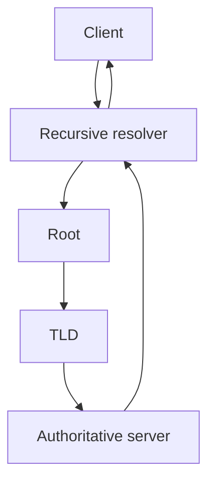

# DNS - Name Resolution, Hierarchy, Security and Records

## Detailed concepts, examples, and edge cases

DNS overview: translates names to IP addresses; hierarchical and distributed. Many servers provide redundancy. DNS hierarchy diagram: root, TLDs, authoritative servers, recursive resolver/client. Example uses professor-related domain names.

Primary/secondary DNS: primary maintains zone information; secondary is read-only copy synchronized from primary. Transparent to end users. Local name resolution can override DNS using hosts files; notes show a local hosts path.

DNS resolver use: forward lookup name->IP; reverse lookup IP->name. `dig domain.com` and `dig -x IP` examples. Apps may bypass/choose alternate name-resolution mechanisms depending on OS configuration.

DNS authority: authoritative server has authority for the zone; non-authoritative answer can come from cache. TTL controls cache lifetime. Recursive query delegates work to resolver; resolver caches and returns answer; subsequent queries use the cached copy until TTL expires.

DNS recursive query diagram from resolver to local/root/TLD/authoritative servers. DNS security concerns: plaintext queries reveal activity. DNSSEC provides signed data/integrity but not query confidentiality. Encrypted DNS can use DoT/DoH.

DNS records: resource records. SOA describes zone details/serial and timers. A/AAAA map names to IPv4/IPv6 addresses. CNAME aliases one name to another; can point multiple service names to a canonical host.

MX identifies mail exchanger. TXT stores readable text/policy data; SPF mail-sender policy is commonly stored in TXT; DKIM publishes verification material in TXT; NS identifies name servers; PTR supports reverse lookup by mapping addresses to names.

## What DNS does
The Domain Name System maps names to resource records in a hierarchical distributed database. DNS allows users and applications to use names such as `www.example.com` instead of numeric IP addresses.

## DNS hierarchy
The namespace is hierarchical:

```text
                    Root (.)
                       |
           +-----------+-----------+
          com         org         net       ...
           |
       example
           |
        www / mail / vpn ...
```

A fully qualified domain name is resolved by following the hierarchy from the root toward the authoritative zone for the name.

## Recursive resolution
A client normally asks a recursive resolver. If the resolver does not already have a usable cached answer, it performs the lookup on the client's behalf.

```text
Client
  |
  | recursive query
  v
Recursive resolver
  |
  +--> root server
  |
  +--> TLD server
  |
  +--> authoritative server
  |
  +<-- answer + TTL
  v
Client receives answer
```

## Authoritative vs non-authoritative
- **Authoritative server:** has authoritative data for a zone and answers from that zone data.
- **Non-authoritative answer:** obtained from cache or another non-authoritative source.

## DNS record types

### A
Maps a hostname to an IPv4 address.

### AAAA
Maps a hostname to an IPv6 address.

### CNAME
An alias pointing to another canonical name. A CNAME is a DNS name, not an IP address.

### MX
Identifies mail-exchanger hosts for a domain, with a preference value used to prioritize mail servers.

### TXT
Carries arbitrary text data. Common uses include domain verification, SPF policies and other application metadata.

### NS
Specifies authoritative name servers for a zone.

### PTR
Used for reverse DNS, mapping an IP address to a name under reverse-mapping zones such as `in-addr.arpa` and `ip6.arpa`.

### SOA
The Start of Authority record identifies zone-level administrative and timing data, including the serial number and timers associated with zone transfers/caching behavior.

## Primary and secondary DNS servers
A primary (historically "master") DNS server is the authoritative source from which zone data is maintained. Secondary servers maintain a read-only copy obtained through zone transfer mechanisms. Clients usually do not care which authoritative server is primary/secondary; the distinction is administrative.

## Local name resolution
A host may consult local mechanisms such as:

1. local cache;
2. hosts file;
3. configured DNS resolver;
4. application-specific mechanisms.

The exact resolution order is operating-system dependent.

## `dig` examples

```bash
dig example.com A
dig example.com AAAA
dig -x 192.0.2.1
```

The answer section shows records, TTL and data. The `SERVER:` line identifies the resolver that answered the query.

## DNS transport and encrypted DNS
Traditional DNS commonly uses UDP 53; TCP 53 is also part of DNS and is required for operations such as zone transfers and can be used for responses that need TCP.

- **DoT (DNS over TLS):** DNS carried over TLS, commonly TCP 853.
- **DoH (DNS over HTTPS):** DNS queries carried inside HTTPS, commonly TCP 443.

Encryption can hide DNS content from passive observers on the path, but it does not by itself establish that the destination web service is trustworthy.

## DNS security extensions and related mechanisms
**DNSSEC** adds authenticity and integrity validation to DNS data through signed records and a chain of trust. DNSSEC does not encrypt DNS queries.

**SPF, DKIM and DMARC** are email-authentication mechanisms that use DNS-published policy/keys. SPF is published in a TXT record; DKIM publishes public keys in TXT records; DMARC publishes policy in TXT records.

## DNS TTL
Each DNS record can include a TTL in seconds. A recursive resolver can cache the record for up to that period before it should retrieve fresh authoritative data, subject to protocol/server behavior.

Do not confuse DNS TTL with IP TTL/Hop Limit: one controls cache lifetime, the other controls packet lifetime.

## DNS attacks and defenses
Common security concerns include spoofing/cache poisoning, rogue DNS servers, domain abuse and reflection/amplification attacks. Defenses include DNSSEC validation, authenticated/controlled resolvers, network monitoring, access control and sensible response-rate limiting where appropriate.

## Recursive DNS lookup


## Verified / corrected technical details

- DNS over TLS (DoT) is commonly TCP 853; DNS over HTTPS (DoH) is transported as HTTPS and commonly uses TCP 443.
- DNSSEC provides data authenticity/integrity; it does not encrypt DNS queries.
- SPF is published as TXT data; DKIM public keys are also published via TXT records; DMARC policy is published via a TXT record.

## Verification references

The links below document the verification basis for this file and are optional for study.

- [IETF RFC 1034 — DNS Concepts and Facilities](https://www.rfc-editor.org/rfc/rfc1034)
- [IETF RFC 1035 — DNS Implementation and Specification](https://www.rfc-editor.org/rfc/rfc1035)
- [IETF RFC 6762 — Multicast DNS](https://www.rfc-editor.org/rfc/rfc6762)
- [IETF RFC 6761 — Special-Use Domain Names](https://www.rfc-editor.org/rfc/rfc6761)
