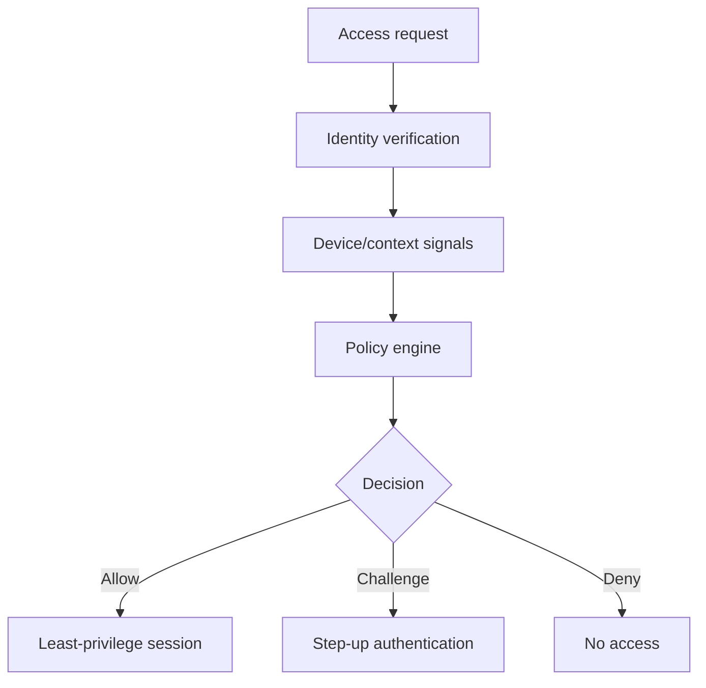

# Security Concepts, Zero Trust and Access Control

## Detailed concepts, examples, and edge cases

Zero trust: inside networks may otherwise be open; do not assume trust just because a system is internal. Verify users/devices, use adaptive identity/context and explicit policy decisions.

Authorization after authentication determines rights. Context can include location, device certification and time/day. Least privilege means minimum access needed; applications should run with minimal privilege; avoid unnecessary administrator rights.

Secure Access Service Edge / SASE-style access from different locations. Security services/policy can be applied across user/device/cloud access; diagram shows users and infrastructure connected through secure policy controls.

Software-defined networking: move network control functions from dedicated hardware into software. Functions divided into data/forwarding plane, control plane and management/application plane.

SD-WAN: software-defined networking in WAN; centralized policies/control, zero-touch provisioning, transport agnostic behavior across fiber/DSL/LTE/5G, and centralized policy distribution.

SD-WAN/overlay-style diagram connecting remote sites to shared services. Services may include databases, web services and email; centralized networking can abstract diverse underlay links.

## Zero Trust
Zero Trust is a security architecture philosophy in which access is not automatically trusted because a user/device is "inside" a network. NIST SP 800-207 emphasizes protecting resources and continuously evaluating access based on identity, device, context and policy rather than relying on network location alone.

Core ideas:

- no implicit trust based solely on network location;
- explicit authentication and authorization;
- least-privilege access;
- continuous/ongoing evaluation and monitoring;
- strong device and user identity;
- logging and policy enforcement around specific resources.

## Adaptive identity / policy-based access
Access decisions can consider more than a username/password, such as:

- user identity and role;
- device identity/posture;
- network/location;
- application being accessed;
- time of day;
- authentication strength;
- risk signals.

The policy engine can then allow, deny or require stronger authentication.

## Authentication vs authorization
Authentication proves an identity or identity claim. Authorization decides what that authenticated subject can access and what actions it can perform.

```text
Identity claim
     ↓
Authentication
     ↓
Context / policy evaluation
     ↓
Authorization decision
  ↙       ↓        ↘
Allow   Challenge   Deny
```

## Least privilege
Grant the minimum permissions needed for a task and remove unnecessary privilege. This applies to users, services, applications, containers, cloud identities and administrators.

### Practical examples
- A monitoring account can read metrics but cannot change configuration.
- A web application account can write only to its required database tables.
- Network operators use separate admin accounts rather than daily-user accounts.

## RBAC
Role-Based Access Control associates permissions with roles, then assigns users/groups/devices to those roles. Examples include help-desk, network-operator, security-analyst and administrator roles.

## SASE
Secure Access Service Edge combines networking and security functions as distributed/cloud-delivered services close to users and resources. Depending on product, SASE architectures can combine SD-WAN with security functions such as secure web gateway, CASB, firewall-as-a-service and zero-trust network access.

The key idea is not a single appliance but a service architecture that applies policy close to where access occurs.

## Access control and policy enforcement
Policy can be applied at multiple layers:

- network ACLs and firewalls;
- identity-aware proxies;
- application authorization;
- endpoint management/NAC;
- cloud IAM/security groups;
- data-layer permissions.

No single control should be assumed to provide complete protection.

## Zero-trust access decision


## Verification references

The links below document the verification basis for this file and are optional for study.

- [NIST SP 800-207 — Zero Trust Architecture](https://csrc.nist.gov/pubs/sp/800/207/final)
