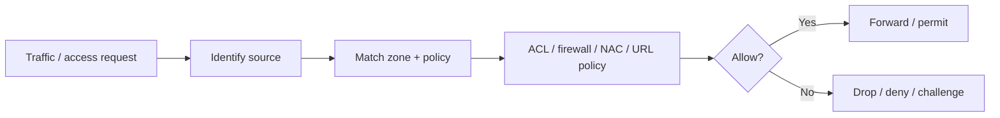

# Device Security, ACLs, URL Filtering, Content Filtering and Security Zones

## Detailed concepts, examples, and edge cases

Device security: disable unnecessary ports/services; control access with firewall/NAC; disable unused/unknown remote management; use port scanners/verification; change default credentials and verify defaults for applications/appliances.

Port security: prevent unauthorized users from connecting to a switch interface; limit MAC addresses/port behavior. Disable unused interfaces for security and administrative control. NAC/802.1X can enforce authenticated network access.

NAC/security monitoring and key management: detect suspicious services/devices, maintain security monitoring, centralize key/service credentials and policies. This material emphasizes understanding what is deployed and keeping security visibility.

Security rules: ACLs allow/deny traffic based on conditions/groups. Restrict access to network devices and limit non-admin access. Firewall rule order matters; specific rules can appear before broader rules; implicit deny is often the fallback.

Example firewall/ACL table showing source IP, destination port/protocol and action. URL filtering uses category/reputation based rules and URL allow/block lists. Categories can include gambling, malware, travel etc.; policies depend on platform.

Content filtering controls traffic/content based on data inside, organizational/inappropriate-content policy and malware protection. Screened subnet/DMZ separates internal and public-facing services using redirects/firewalls. Security zones group resources by trust; zone-based security can simplify policy enforcement.

## Device hardening
Network-device security starts with reducing attack surface and controlling administration.

### Core hardening checklist

1. Disable unused interfaces and services.
2. Remove or restrict insecure legacy protocols and unnecessary remote-management services.
3. Change default usernames/passwords and use strong unique administrator credentials.
4. Use centralized authentication where appropriate.
5. Restrict management access to trusted networks or management planes.
6. Keep firmware/software supported and patched.
7. Back up configurations securely.
8. Enable logging, monitoring and alerting.
9. Use secure management protocols such as SSH/HTTPS rather than plaintext Telnet/HTTP.
10. Apply least privilege to administrator roles.

## Port security
Port security limits which source MAC addresses may appear on a switch interface. Depending on the platform/mode, the switch can learn secure MACs dynamically, accept statically configured addresses, limit the number of devices, and take an action on violations.

Common violation responses include alert/logging, dropping violating frames, or disabling the interface. Exact options vary by vendor.

## NAC and 802.1X
Network Access Control determines whether a device/user may access the network. 802.1X provides port-based access control using an authenticator such as a switch/AP and an authentication server such as RADIUS.

```text
Supplicant (device)
       |
    802.1X
       |
Authenticator (switch/AP)
       |
   EAP/RADIUS
       |
Authentication Server
```

The network can place a device into an appropriate VLAN/role after authentication.

## Access Control Lists (ACLs)
ACLs match traffic or packets against ordered conditions and then permit, deny, log or otherwise act on matching traffic. Common match fields include source/destination address, protocol, ports and interface/direction.

### Rule order
Many ACL/firewall systems use first-match processing:

```text
packet → rule 1 → rule 2 → rule 3 → ... → default/implicit behavior
```

A broad rule placed before a specific rule can prevent the specific rule from ever being evaluated. Explicitly document the intended order.

## Example policy

| Source | Destination | Port | Protocol | Action |
|---|---|---:|---|---|
| Any | Any | 22 | TCP | Allow (management source restricted in practice) |
| Any | Server network | 443 | TCP | Allow |
| Any | Any | Any | ICMP | Policy dependent |
| Any | Any | Any | Any | Deny |

This is only an illustrative rule set; a real firewall must consider state, zones, administrative interfaces and business requirements.

## URL filtering
URL filtering can allow/block websites based on explicit URLs, domains, categories or reputation. Categories may include malware, gambling, adult content, social media or other policy groups depending on the vendor.

## Content filtering
Content filtering examines data or metadata and applies policy based on categories, file types, patterns, malware verdicts or organizational policy. It can be implemented in secure web gateways, firewalls, email security systems and other inspection platforms.

## Screened subnet / DMZ
A screened subnet, commonly called a DMZ, places publicly accessible services in a security zone separated from the internal network.

```text
Internet
   |
Edge firewall
   |
 DMZ / screened subnet
   |        |
 Web     Mail/VPN
   |
Internal firewall
   |
Internal LAN
```

A DMZ reduces direct exposure of internal systems. It is not a guarantee that a compromised DMZ host cannot reach the internal network; explicit firewall policies are still required.

## Security zones
Security zones group interfaces/resources that share a trust or policy requirement, such as:

- External/Internet
- DMZ
- Internal
- Guest
- Management
- Highly restricted/sensitive

Zone-based security can simplify policy by allowing rules such as "Internet → DMZ HTTPS permitted; Internet → Internal denied; Guest → Internal denied; Management → Devices via SSH/HTTPS permitted." Exact rule syntax depends on the firewall.

## Policy enforcement path


## Verified / corrected technical details

- ACL processing is commonly first-match, but exact order/default behavior depends on the platform. Do not assume every ACL has an implicit deny or identical logging semantics.
- NAC and 802.1X are related but not identical: NAC is the broader access-control architecture; 802.1X is a port-based access-control standard commonly used within NAC implementations.
- A DMZ/screened subnet reduces exposure through policy separation; it is not a guarantee that a compromised DMZ host cannot reach internal systems.

## Verification references

The links below document the verification basis for this file and are optional for study.

- [Cisco — Layer-2 security features (port security, DHCP snooping, DAI, IP Source Guard)](https://www.cisco.com/c/en/us/support/docs/switches/catalyst-3750-series-switches/72846-layer2-secftrs-catl3fixed.html)
- [NIST SP 800-207 — Zero Trust Architecture](https://csrc.nist.gov/pubs/sp/800/207/final)
