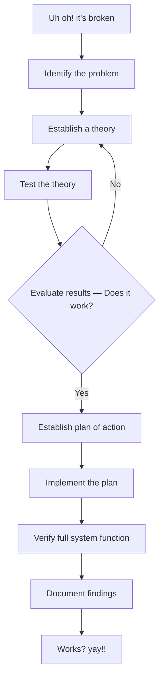

# Network Troubleshooting Methodology

## Overview
A repeatable troubleshooting methodology prevents random changes and keeps investigation evidence-driven. The sequence used in the notes is: identify the problem, establish a theory, test it, evaluate the result, establish a plan, implement, verify, and document.

## Core concepts
- Identify: gather symptoms, ask users what changed, reproduce the problem, and define its scope.
- Establish theory: start with obvious causes and use top-down, bottom-up, or divide-and-conquer reasoning.
- Test: perform a controlled change or test that distinguishes between competing hypotheses.
- Evaluate: decide whether the evidence supports the theory; if not, return to theory generation.
- Plan and implement: minimize downtime, prepare a rollback, and escalate when required.
- Verify and document: test the original use case and preserve the cause, evidence, fix, and verification results.

## Practical examples
- For a Wi-Fi outage, check whether one device or many are affected, whether the access point is reachable, whether DHCP/addressing works, and whether DNS or only one application is failing.
- For a cable problem, replace one variable at a time and see whether the problem follows the cable, port, or host.

## Security / mitigation
- Prefer low-impact tests first.
- Change one meaningful variable at a time where practical.
- Record the pre-change state.
- Keep a rollback path.
- Document final findings for future troubleshooting and incident response.

## Detection / troubleshooting
- Relevant evidence can include interface counters, DHCP/DNS logs, authentication logs, routing tables, packet captures, and before/after configuration states.

## Detailed notes captured from the notebook
## Flowchart

## 1. Identify the problem
- Gather info.
  - E.g. log duplicating issue.
  - Question users.
  - Identify symptoms.
- What has changed??
  - From when it was working fine?

## 2. Establish theory
- Start with obvious.
- Consider everything.
  - Examine problem from top of OSI model to bottom.
  - And reverse.
- Divide & conquer.

## 3. Test the theory
- A virtual / test change.
- Yes → continue.
- No → re-establish theory.

## 4. Create a plan
- Build a plan.
  - With minimum impact on uptime.
- Have backup plans (rollback tool).

## 5. Implementation
- Try the fix.
- Escalate as necessary.
  - 3rd party.

## 6. Verify system function
- Testing → use case(s).

## 7. Document finding
- For future use.
- Forensics.
- Create a formal DB **[source wording unclear]**.

## Further reading (optional)
Verified against current security-engineering guidance; see `WEB_VERIFICATION.md` for the external verification set.
