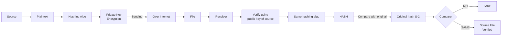

# Non-Repudiation, Integrity & Origin

## Overview
Integrity means data has not been altered without authorization; origin/authenticity asks whether data came from the claimed sender; non-repudiation provides evidence that a party performed or approved an action. Hashes and digital signatures are key mechanisms here.

## Core concepts
- Hashing produces a fixed-length digest used to detect changes; a hash does not by itself provide confidentiality.
- A digital signature is created with a private key and verified with the corresponding public key.
- A signature binds the signed data to the signer and lets a verifier detect unauthorized modification.
- Non-repudiation is a stronger evidentiary property than simple integrity and depends on trustworthy key control and identity binding.

## Practical examples
- Software updates may be distributed with digital signatures; the client verifies the signature before installation.
- A file hash can be compared with a known-good published digest to detect modification.

## Security / mitigation
- Protect private signing keys, use approved algorithms, and validate the trust chain and certificate context.
- Do not treat a bare hash as proof of origin; anyone who can recompute the hash can produce the same digest.

## Detection / troubleshooting
- Look for signature-validation failures, unexpected signer identities, changed hashes, and binaries that no longer validate against the expected signing chain.

## Detailed notes captured from the notebook
# Non-Repudiation, Integrity & Origin

# Non-repudiation
- Can't deny what you said in a contract
- Confirms IT was you
- Can add a digital perspective for cryptography

## Proof of integrity
- Verify data hasn't been changed
- In cryptography:
  - Use a hash
  - Data change -> hash change
  - Even a minor change -> major impact
  - Does not reveal data / content

## Proof of origin
- Prove source of the message
- Sign with private key
- Check with public key

## Flow: proof of origin / integrity
`Source -> Plaintext -> Hashing algo -> Private key (signing) -> Over Internet -> Receiver`

Receiver:
- Verify using public key of sender
- Same hashing algo
- `HASH` -> compare with original hash -> if **NO**: FALSE; if **SAME**: SOURCE AUTH VERIFIED

## Further reading (optional)
Verified against current security-engineering guidance; see `WEB_VERIFICATION.md` for the external verification set.
