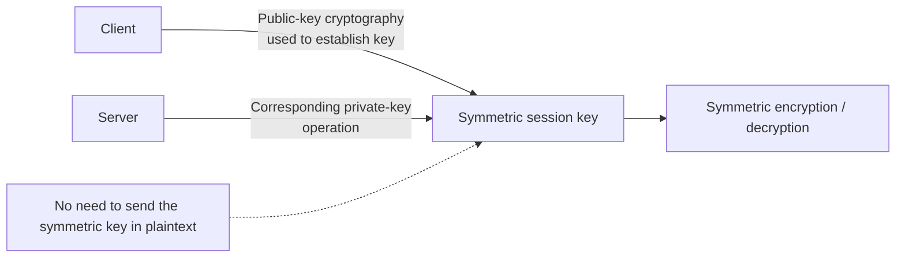

# Key Exchange

## Overview
Key exchange solves the problem of establishing a shared secret over an untrusted network. Common approaches use asymmetric cryptography or Diffie-Hellman-style key agreement to establish a symmetric session key, after which the faster symmetric algorithm protects the data stream.

## Core concepts
- Out-of-band exchange moves key material through a separate trusted channel.
- In-band key establishment happens over the network and must resist interception or impersonation.
- Diffie-Hellman and ECDH derive a shared secret without sending that secret directly.
- Ephemeral key pairs provide forward secrecy when used with modern protocols and authenticated correctly.
- Hybrid encryption combines public-key operations for setup with symmetric encryption for bulk data.

## Practical examples
- TLS commonly performs an authenticated handshake and then protects application traffic with symmetric session keys.

## Security / mitigation
- Use authenticated key exchange, validate server identity, use ephemeral parameters where supported, and rotate session keys according to protocol policy.

## Detection / troubleshooting
- Look for failed handshakes, certificate errors, unexpected algorithms, downgrade attempts, and repeated connection resets.

## Detailed notes captured from the notebook

## Second reconstruction — symmetric key derived/established using asymmetric cryptography

# Symmetric keys from asymmetric keys
- Use public/private key cryptography to create a symmetric key

Flow:
- Client [encrypt with server public key] -> symmetric key -> server [server private key]
- Symmetric key is then used
- No need of sending keys [thereafter]

## Further reading (optional)
Verified against current security-engineering guidance; see `WEB_VERIFICATION.md` for the external verification set.
