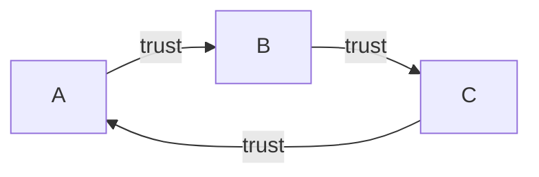

# Certificates & Root of Trust

## Overview
Certificates bind an identity or name to a public key under a trust framework. The root of trust is the anchor from which a verifier builds a chain through intermediate CAs to an end-entity certificate.

## Core concepts
- A certificate contains subject/SAN names, issuer, validity, serial number, public key, signature algorithm, and extensions.
- A CA signs certificates; a browser or operating system trusts selected root CA certificates.
- A CSR contains the applicant's public key and identity information and is signed by the applicant to prove possession of the private key.
- Private/internal CAs can issue certificates for controlled environments; clients must trust the appropriate internal root.

## Practical examples
- A browser can inspect the issuer, validity period, SANs, public-key algorithm, and signature algorithm of a site certificate.

## Security / mitigation
- Protect CA private keys, use separate offline/root and issuing CAs where appropriate, validate SANs, and renew certificates before expiry.

## Detection / troubleshooting
- Detect expired certificates, invalid chains, unexpected issuers, name mismatches, and unauthorized CA/key changes.

## Detailed notes captured from the notebook
# Certificates & Root of Trust

## Digital certificate
- Public key certificate
  - bind public key with a CA and other details
- A digital sign adds trust
  - it's all about who to TRUST
- Certificate creation can be built into OS
- X.509 -> standard format

## Details
- Serial no.
- Version
- Sign algo
- Issuer
- Name of holder
- Public key
- Extension
- and more



# Root of Trust
- Everything associated req. trust
- How to build it?
- Refer to root of trust
  - a trusted comp
  - hardware, software, firmware & other comp.
  - e.g. HSM, security enclave, CA etc.

## Certificate Authority
- Connect to random website -> ensure you trust
- Check if it is signed by a CA your browser/system trust
- A trust B
- B trust C
- C -> A [trust relationship diagram as drawn]

```mermaid
flowchart LR
    AP[Applicant]

    K1[App. Private Key]
    K2[App. Public Key]
    ID[Applicant Identity Form]
    CSR[Certificate Signing Request (CSR)]
    V[Validate Applicant Identity]
    CPK[CA's Private Key]
    CERT[Digitally Signed Certificate]

    K1 --> CSR
    K2 --> CSR
    ID --> CSR
    CSR --> V
    V --> CPK
    CPK --> CERT
    CERT --> AP
```

## Third-party CA
- Built-in your browser
- Perhaps your website certificate
- CA is responsible for verifying the request
  - CA however may verify your identity

## Root of Trust

## Certificate Signing Request (CSR)
Flow:
- App. private key + App. public key -> Certificate Signing Request (CSR)
- Applicant submits request
- Validate applicant identity
- CA's private key -> digitally signed certificate
- Certificate published

# Private CA
- You are your own CA
  - for internal network
  - add it to trusted chain
- For medium-to-large companies
- Implement as part of your overall computing strategy
  - Windows cert services
  - OpenCA

## Self-signed certificate
- Internal certs don't need to be signed by public CA
- Install CA certificate / trusted chain on EACH DEVICE

## Further reading (optional)
[RFC 5280 — X.509 PKI](https://www.rfc-editor.org/rfc/rfc5280.html)
