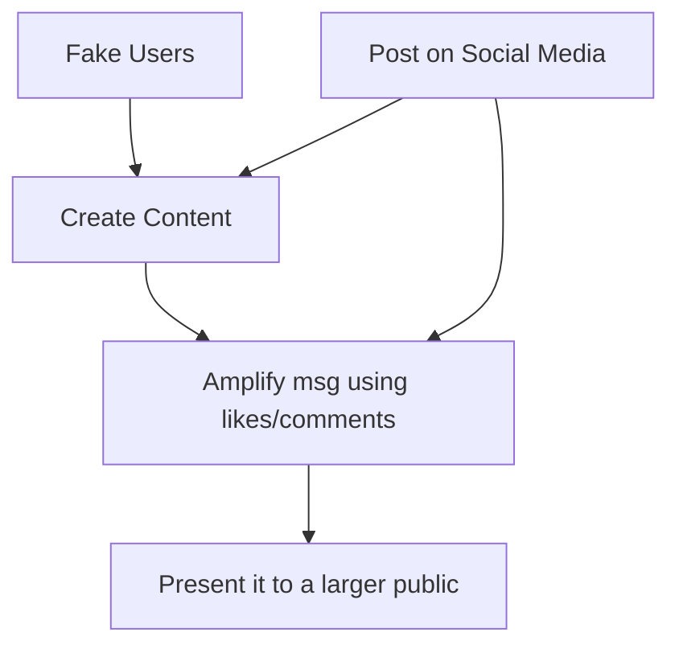

# Social Engineering & Impersonation

## Overview
Social engineering attacks manipulate people rather than relying only on technical exploits. Impersonation, pretexting, elicitation, watering holes, phishing variants, and misinformation are examples of human-targeted techniques.

## Core concepts
- Pretexting invents a believable story to obtain information or action.
- Impersonation pretends to be a trusted person or organization.
- Elicitation uses conversation and social cues to extract information.
- Watering-hole attacks compromise a site likely to be visited by a target population.
- Misinformation is false information spread without necessarily requiring malicious intent; disinformation is deliberately deceptive.
- Brand impersonation exploits trust in a known organization.

## Practical examples
- A fake support call may request a one-time code; a fake brand site may imitate a login page; a watering hole may compromise a site frequently visited by a specific community.

## Security / mitigation
- Use security awareness, out-of-band verification, phishing-resistant MFA, DNS/web filtering, endpoint protection, and least-privilege controls.

## Detection / troubleshooting
- Correlate suspicious login pages, newly registered look-alike domains, repeated social-engineering reports, and unusual credential-use patterns.

## Detailed notes captured from the notebook
# Impersonation
## Pretext
- Setting a trap - story
- E.g. “My name is Wendy and I'm from Microsoft, this is an urgent call to check up your computer for potential malware.”

## Impersonation
- Pretending someone they are not
  - E.g. person from govt etc.
  - throwing tons of tech info to distract
- Use details from reconnaissance

# Elicit Information
- Get info from victim without him realizing what he is sharing
- Often seen as vishing
- Make it important gain trust
  - don't just ask your password directly

# Identity fraud
- Using your identity to open up account anywhere
  - E.g. a credit card in bank account
- Gain access & benefit from your identity

# Watering Hole Attack
- Attacker can't get in any way
- So they will just poison a watering hole; wait for you to drink from it
- Determine which website the victim group uses
- Infect one of these websites
  - then wait for target to get infected
  - infect all visitors
- Requires a lot of research

## To defend
- Firewall + AV + IPS
- Signature blocking

# Other Social Eng. Attacks
## 1. Misinformation / disinformation
- Create confusion, chaos by spreading false info
  - political
  - religious
  - or any way to organise chaos
- E.g. advertisements
- social media

### Process (flow)
`Fake users -> post on social media -> create content -> amplify using like/comments -> present to a larger public`

## 2. Brand impersonation
- Pretend to be a well-known brand
- Creates tens of thousands of impersonation sites
  - click a Ad -> redirect
- Pop-up malwares
- Malware injection!!

## Further reading (optional)
Verified against current security-engineering guidance; see `WEB_VERIFICATION.md` for the external verification set.
