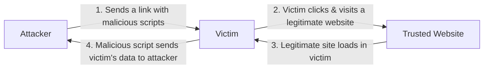

# Cross-Site Scripting (XSS)

## Overview
Cross-Site Scripting (XSS) occurs when attacker-controlled content is executed in a victim's browser in the context of a trusted web application. Common categories are stored, reflected, and DOM-based XSS.

## Core concepts
- Stored XSS is persisted by the application and executed when other users view the affected content.
- Reflected XSS is returned immediately in a response, often through crafted request parameters.
- DOM-based XSS occurs when client-side code uses untrusted data in an unsafe DOM sink.
- Impact can include session abuse, data theft, UI manipulation, and actions performed with the victim's privileges.

## Practical examples
- A comment field that stores unsanitized script content can create stored XSS for everyone who views the page.

## Security / mitigation
- Use contextual output encoding, safe templating, input validation as a supporting control, Content Security Policy where appropriate, and secure framework defaults.
- Do not rely on a single blacklist or browser setting as the sole defense.

## Detection / troubleshooting
- Detect unusual script injection patterns, CSP violations, WAF alerts, unexpected script sources, and suspicious changes to rendered content.

## Detailed notes captured from the notebook
# Cross-Site Scripting (XSS)

- Originally called cross-site because of browser security flaw
  - Info from one site could be shared to another
- One of most common web vuln
  - takes advantage of trust a website has for a site
  - although complicated
- XSS commonly uses JS
  - everyone usually has JS enabled

# Non-persistent (reflected) XSS attack
- Website allows scripts to run in user input
- Attacker exploits a flaw / vulnerability
  - sends victim a link to steal data
- Script is embedded in URL / executes in victim's browser
  - Attacker gets data
  - Gain access -> spyware

# Persistent (stored) XSS attack
- Attacker posts a msg to a social network
  - includes malicious code
  - it is persistent
  - everyone viewing gets it

## Stored XSS continuation
- For social networks, this can spread quickly
  - everyone who views msg can have that JS/code executed
- The original notebook included a named example here, but the handwritten name was not legible; the stored-XSS concept is fully explained above.
- Hacking a server

# Protecting against XSS
1. Never open links -> browse manually
2. Consider disabling JS
3. UPDATE
4. Validate input anyway as a developer

## Further reading (optional)
[OWASP — XSS Prevention](https://cheatsheetseries.owasp.org/cheatsheets/Cross_Site_Scripting_Prevention_Cheat_Sheet.html)
