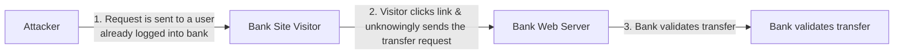

# Cross-Site Requests / CSRF

## Overview
Cross-Site Request Forgery (CSRF) abuses a victim's authenticated browser session so a trusted site receives a request the victim did not intend. The attack is different from XSS: CSRF abuses the application's trust in the user's authenticated browser, while XSS executes attacker-controlled content in the application's origin.

## Core concepts
- Browsers can automatically attach cookies to requests, which is why state-changing endpoints need CSRF defenses when cookie-based authentication is used.
- Primary defenses include framework-provided CSRF protections, anti-CSRF tokens, origin validation, Fetch Metadata, and appropriate SameSite cookie settings.
- State-changing actions should not rely on GET requests.
- Strong user interaction or re-authentication can be an additional defense for sensitive operations.

## Practical examples
- A victim logged into a bank may click a malicious link that causes their browser to send a transfer request; without CSRF protection, the server may mistake it for a legitimate request.

## Security / mitigation
- Use synchronizer tokens or securely implemented double-submit cookies, validate Origin/Referer where appropriate, and configure SameSite cookies deliberately.

## Detection / troubleshooting
- Look for state-changing requests with cross-site context, missing/invalid CSRF tokens, suspicious referers/origins, and unusual transfer or account-change activity.

## Detailed notes captured from the notebook
# Cross-Site Requests / CSRF

# Cross-Site Requests
- A webpage may load info from diff servers
  - E.g. a youtube video, photos from diff sources
- HTML? [Normal & expected]
- Most of these are uncommon [wording unclear]

## Client / Server
- Website -> client-side code
  - Browser
  - JS, HTML
- Server side
  - performs request from client
  - HTML, PHP
  - E.g. transfer money bits
  - no such? investment

- Attacker knows some site is a client, some-server??
  - take adv. of this
- One click attack, session riding
  - E.g. XSRF, CSRF (see army?)
- Take advantage that a web app has a user
  - request made without your consent / knowledge
  - E.g. post of social media
- This is a significant web app development oversight
  - app should have anti-forgery token

Flow:
1. Request is sent via attacker to a user who is already logged into bank website
2. Victim clicks link attacker sends the transaction to bank server
3. Bank validates transfer [continuation on next page]

# Cross-Site Request Forgery (CSRF) - continuation
- Continue flow: attacker causes transfer request; bank web server; bank validates transfer
- Web request can be made while victim is authenticated
- Anti-CSRF token / anti-forgery token should be used

## Further reading (optional)
[OWASP — CSRF Prevention](https://cheatsheetseries.owasp.org/cheatsheets/Cross_Site_Request_Forgery_Prevention_Cheat_Sheet.html)
