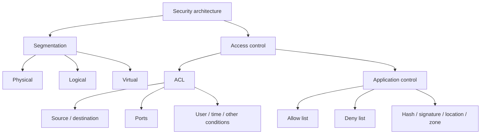

# Segmentation and Access Control

**Course:** CompTIA Security+ SY0-701  
**Professor:** Professor Messer  
**Course section:** 2.5 — Mitigation Techniques  
**Coverage:** Pages 9–10 of this batch

## Security Architecture

Network security can be implemented using **physical, logical, and virtual controls**.

Segmentation breaks a network or environment into smaller areas. This can reduce the scope of a security event, simplify access control, and support security or compliance requirements.

### Types of segmentation

- **Physical segmentation:** devices or systems are physically separated.
- **Logical segmentation:** separation is created logically, such as with VLANs.
- **Virtual segmentation:** separation is commonly used in cloud and virtual-machine environments.

Segmentation can also be used for performance. A high-bandwidth application may be placed on its own subnet so unrelated network activity does not affect its throughput.

A security-focused example is preventing users from communicating directly with a database server. The user communicates with an application server, and the application server communicates with the database.

Segmentation may also be required by policy or compliance. For example, systems containing payment-card information may need to be separated from other parts of the network.

## Access Control Lists (ACLs)

An **Access Control List (ACL)** is a collection of rules that allows or disallows access based on defined conditions.

ACLs can be implemented in:

- Network devices.
- Operating systems.
- Firewalls.
- Other technologies that make access decisions.

### Conditions used by ACLs

Access decisions can be based on details such as:

- Source IP address.
- Destination IP address.
- Port number.
- User or account.
- Time of day.
- Other traffic or access attributes.

ACLs can therefore be broad or highly granular.

For example:

```text
Bob    → can read files on a particular resource

Fred   → can access the network

James  → can access the 192.168.1.0/24 network
         using TCP ports 80, 443, and 8088
```

The James rule is much more specific because it restricts both the destination network and the TCP ports that may be used.

### ACL design considerations

When configuring ACLs, consider all required connections before applying a rule. An overly restrictive rule can prevent legitimate communication.

A particularly important administrative concern is avoiding an ACL configuration that accidentally **locks the administrator out of the device or prevents additional ACL rules from being created**.

### ACLs in operating systems

ACLs are not limited to network traffic.

When permissions are configured on files or folders, or when users are placed into groups with defined permissions, the operating system is using access-control rules.

## Application Allow Lists and Deny Lists

Another form of application-level control is an **application allow list** or **application deny list**.

Organizations use these controls to determine which applications are permitted to run.

They can help prevent malicious or unwanted software such as:

- Trojan horses.
- Malware.
- Viruses.
- Other unauthorized applications.

### Allow list

With an **allow list**:

> Nothing runs unless it has been specifically approved.

This is a restrictive approach. Only applications that satisfy the allow-list rules are permitted to execute.

### Deny list

With a **deny list**:

> Anything specifically identified as prohibited is prevented from running.

Applications that are not on the deny list may continue to run.

A common example is antivirus or anti-malware software. Software may be allowed to execute until the security product identifies it as known-bad malware, after which the malicious application is blocked.

## Application Identification

Application-control rules can identify software in several ways.

### Application hash

An application can be identified using a **hash** rather than only its filename.

If the application's contents change, its hash changes as well. The original hash-based rule would then no longer match the modified application.

### Digital signature

Applications can also be identified by their **digital signature**.

A rule can allow applications signed by a trusted organization, such as Microsoft, Adobe, Google, or another approved publisher. An application that does not meet the required signing condition can be blocked.

### File-system location

Application-control rules can also restrict software based on where the application is stored.

For example, an organization may permit an application when it runs from an approved directory but block the same application when it is launched from another location.

### Network zones

Application rules can also depend on the network zone.

Different policies can apply depending on whether a system is connected to a private/trusted network or a public/untrusted network.

## Summary

Segmentation reduces the scope of access and potential security events. ACLs provide granular control over who or what can communicate with which resources, while application allow lists and deny lists control which software can execute.


