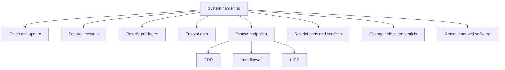

# Hardening Techniques

**Course:** CompTIA Security+ SY0-701  
**Professor:** Professor Messer  
**Course section:** 2.5 — Mitigation Techniques  
**Coverage:** Pages 13–15 of this batch

## What Is System Hardening?

System hardening means applying security controls and configuration changes that make a system more difficult to compromise.

Important hardening areas include:

- Security updates and patches.
- User-account security.
- Limiting privileges.
- Restricting network access.
- Monitoring services and activity.
- Encryption.
- Endpoint security.
- Controlling open ports and services.
- Changing default credentials.
- Removing unnecessary software.

Hardening is a **defense-in-depth** activity. No single security setting provides complete protection, so multiple controls are used together.

## 1. Security Updates and Patching

Keeping systems updated is one of the most important hardening steps.

Security updates can close vulnerabilities in:

- Operating systems.
- Applications.
- Other installed software.

Updates should be applied consistently and tested where necessary before broad deployment.

## 2. User Accounts and Privileges

User accounts should be properly secured.

### Password policy

Password policies can require:

- Minimum password length.
- Appropriate password complexity.
- Strong authentication practices.

### Least privilege

Not every user should have administrator access.

Each user should have only the rights and permissions necessary for their work.

Network access should also be restricted where possible. For example, only approved IP address ranges may be allowed to access a particular server.

## 3. Encryption

Encryption protects information from unauthorized access.

### File-level encryption

Individual files or folders can be encrypted.

A Windows example is **Encrypting File System (EFS)**.

### Full Disk Encryption (FDE)

Full Disk Encryption protects the contents of an entire storage volume.

Examples include:

- **BitLocker** on Windows.
- **FileVault** on macOS.

### Network encryption

Network traffic can also be encrypted.

A **Virtual Private Network (VPN)** can encrypt traffic between connected endpoints.

Applications may provide their own encryption as well. For example, **HTTPS** protects communication between a web browser and a web server.

## 4. Endpoint Security

Endpoints include systems such as:

- Desktop computers.
- Laptops.
- Tablets.
- Mobile phones.

Endpoints can be targeted directly from the network. A compromised endpoint can also become a starting point for attacks against other systems.

Different endpoints may run different operating systems and applications, so security controls need to match the platform.

There is no single security control that secures every endpoint. Multiple tools work together to provide defense in depth.

## 5. Endpoint Detection and Response (EDR)

**Endpoint Detection and Response (EDR)** provides large-scale endpoint security and monitoring.

### Detection capabilities

EDR can detect known threats using signatures, but it can also go beyond signatures.

It may use:

- Behavioral analysis.
- Machine learning.
- Process monitoring.
- Endpoint telemetry.

Behavioral analysis watches what users and applications are doing and can identify suspicious activity even when a specific malware signature is not available.

Process monitoring can detect newly started processes and examine them for malicious behavior.

### Investigation

EDR can perform **root-cause analysis** to investigate how suspicious activity occurred and what a process is doing.

After analyzing the activity, EDR can determine whether the behavior should be allowed or treated as malicious.

### Response

When malicious activity is identified, EDR can automatically respond.

Possible actions include:

- Isolating the affected system.
- Quarantining the threat.
- Rolling back to a previous configuration.

EDR actions can be automated through an **Application Programming Interface (API)** and reported to a central management console.

## 6. Host-Based Firewalls

A host-based firewall is a software firewall running directly on a system.

It can:

- Allow or deny inbound traffic.
- Allow or deny outbound traffic.
- Control which processes are permitted to communicate.
- Monitor unusual network activity.

Because the firewall operates on the endpoint, it can observe traffic as it enters or leaves the system.

It can also be centrally managed and may automatically block unusual traffic until it is administratively approved.

## 7. Host-Based Intrusion Prevention System (HIPS)

A **Host-Based Intrusion Prevention System (HIPS)** provides intrusion-prevention capabilities directly on the endpoint.

HIPS may:

- Detect known attack patterns.
- Use heuristics or behavioral changes.
- Protect application configurations.
- Protect operating-system configurations.
- Check inbound updates.
- Block malicious processes.

For example, a HIPS can detect activity such as:

- Buffer-overflow behavior.
- Suspicious registry changes.
- Modification of protected operating-system files.

When malicious activity is detected, the process can be blocked and an alert generated.

## 8. Open Ports and Services

Every externally accessible service normally requires a port to be open.

Each open port is a potential entry point for an attacker to discover and exploit a vulnerability.

### Hardening principle

Close unnecessary ports and services.

Use:

- Host firewalls.
- Network firewalls.
- Application-aware controls where appropriate.

A next-generation firewall can provide more granular control than simply filtering on a port number by also considering the service or application using that port.

Some software can open ports without the user realizing it. An application may even recommend opening an excessively broad port range.

Opening every port is not a secure default.

### Checking ports

If the open-port status of a system is unknown, a port scanner can be used.

**Nmap** is a common tool for identifying open ports and gathering information about accessible network services.

## 9. Default Passwords and Configurations

Routers, switches, firewalls, access points, and applications may initially use default configuration settings.

Default usernames and passwords are often publicly known or easy to discover.

Therefore:

1. Change default credentials immediately.
2. Review default security settings.
3. Enable stronger authentication where supported.
4. Consider multifactor authentication or centralized authentication.

Never assume that a device is secure simply because it was newly installed.

## 10. Remove Unnecessary Software

Every installed application can contain bugs, including potential security vulnerabilities.

A system with many applications can be difficult to maintain because each application may have a different security-update process.

Removing software that is no longer required provides a simple hardening benefit:

- Reduces attack surface.
- Removes unnecessary vulnerabilities.
- Reduces the number of applications that must be patched.
- Simplifies security maintenance.

If an application is no longer being used, removing it eliminates one more software package that must be kept secure.

## Defense in Depth

Hardening works best when multiple controls are combined:

## Summary

Hardening reduces the opportunities available to an attacker. The strongest approach combines timely patching, secure accounts, least privilege, encryption, endpoint monitoring and prevention, restricted network exposure, strong credentials, and removal of unnecessary software.
