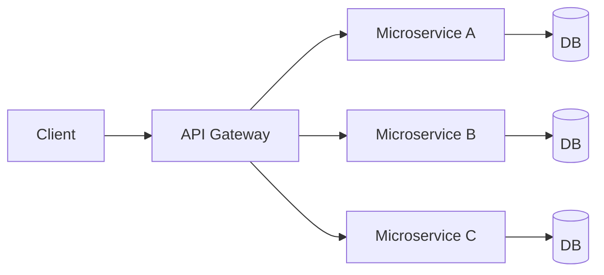

# Microservices and APIs
**Source provenance:** Handwritten lecture notes from Professor Messer’s free CompTIA Security+ **SY0-701** training course.
**Professor Messer course alignment:** 3.1 – Architecture Models → Cloud Infrastructures (handwritten focus: APIs and microservices)
**Coverage:** source pages 19

## Monolithic application
A monolithic application is one large application that does many things. The notes point out that it can contain all major business decisions and become a very large codebase, making change difficult.

## Microservices architecture
In the cloud, APIs and microservices can divide the system into independent services. The notes associate this with:
- Scalability.
- Resilience.
- Contained outages.
- Per-service databases.
- Built-in security/containment, while recognizing that distributed architectures introduce more components to secure.

The handwritten diagram separates the gateway, microservices, and databases. The important security implication is that trust boundaries multiply: each service/API boundary needs authentication, authorization, input validation, logging, and secure communication.
