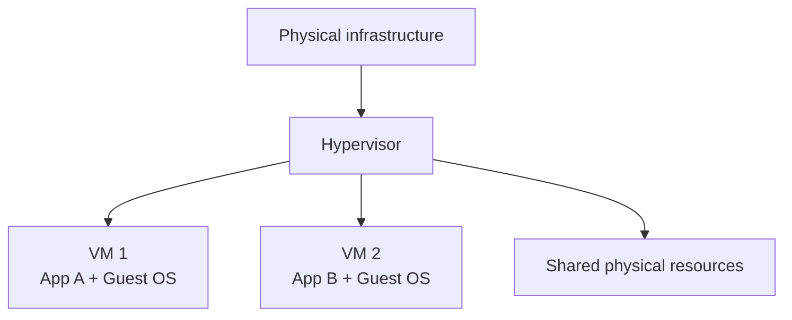
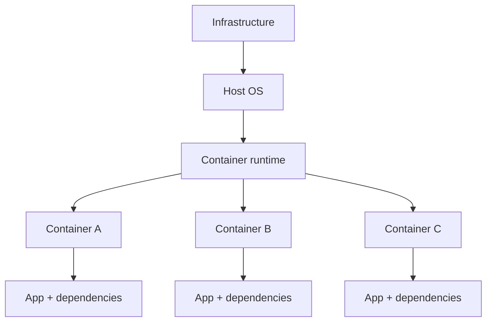

# Other Infrastructure Concepts
**Source provenance:** Handwritten lecture notes from Professor Messer’s free CompTIA Security+ **SY0-701** training course.
**Professor Messer course alignment:** 3.1 – Architecture Models → Other Infrastructure Concepts
**Coverage:** source pages 22–24

## Cloud-based vs. on-premises infrastructure
The notes compare the two models.

### Cloud-based
- No dedicated hardware at the customer site.
- Less direct maintenance burden.
- Security is managed partly by a third party.
- Less customization/control.
- Changes may require provider notice or coordination.
- Useful for decentralized organizations.

### On-premises
- Dedicated hardware.
- Higher infrastructure cost.
- In-house security management.
- More customization and control.
- Security changes can be made directly, subject to operational processes.

## Centralized vs. decentralized
The notes observe that many organizations are physically decentralized across locations, business units, cloud providers, etc., which can make security and management harder. A centralized approach can consolidate alerts/log analysis, system status, maintenance, and patching, but centralization can create a single point of failure or scalability bottleneck.

## Virtualization
Virtualization runs multiple operating systems on shared physical hardware through a hypervisor.

Each VM normally requires its own guest OS, adding complexity and overhead compared with containers.

## Application containerization
Containers package the application and its required user-space dependencies while sharing the host OS/kernel.

The notes associate containers with sandboxing, reduced interaction between applications, lightweight images, a shared host kernel, and portability.
