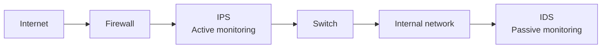

# Secure Infrastructures
**Source provenance:** Handwritten lecture notes from Professor Messer’s free CompTIA Security+ **SY0-701** training course.
**Professor Messer course alignment:** 3.2 – Applying Security Principles → Secure Infrastructures + Intrusion Prevention (pages 35–36)
**Coverage:** source pages 33–36

## Device placement
Every network is different. Use firewalls and separate trusted from untrusted zones. Some services may need dedicated security technologies such as honeypots or jump servers.

## Security zones
Zone-based security can be more flexible than simple IP-range-based policies. Example zones in the notes include:
- Internal / external.
- Trusted / untrusted.
- Inside / outside.
- Servers, databases, screened areas.

Zones make it easier to express security policy in terms of trust boundaries.

## Attack-surface minimization
Minimize the number of paths an attacker can use. Examples from the notes include vulnerabilities, open ports/services, human error, and misconfiguration/authentication processes.

## Connectivity
Use secure network cabling, application-level encryption, and network-level encryption such as VPN/IPsec tunnels. The notes specifically connect network encryption with cases where an attacker may gain physical access.

## Intrusion Prevention Systems (IPS)
An IPS watches traffic and can prevent exploit attempts such as XSS and buffer overflows. The notes distinguish:
- IDS: detection/alert.
- IPS: prevention before the traffic reaches the protected system.

## Failure modes
- **Fail-open:** system failure leaves traffic/data flowing; availability is favored but security can be reduced.
- **Fail-closed:** system failure stops traffic/data; security is favored but availability can be reduced.

## Active vs. passive monitoring
Active monitoring can inspect traffic and block in real time, such as an IPS. Passive monitoring observes/copies traffic and generates alerts without real-time blocking, such as an IDS.

