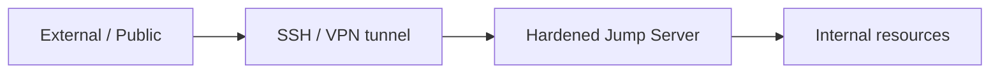
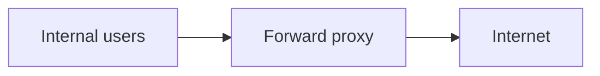
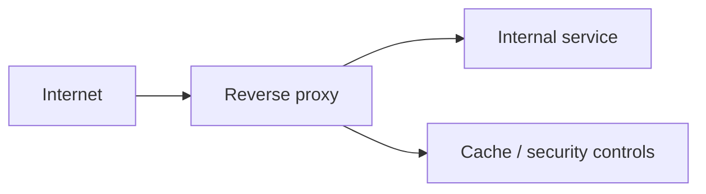
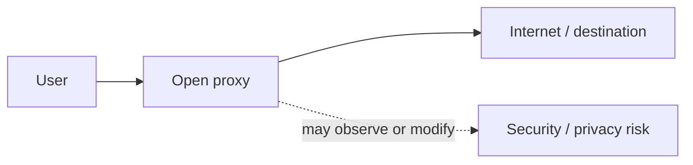
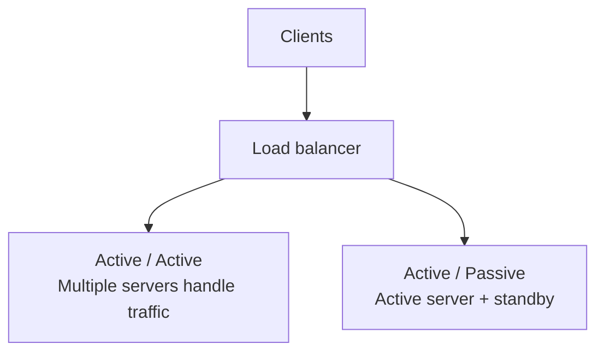
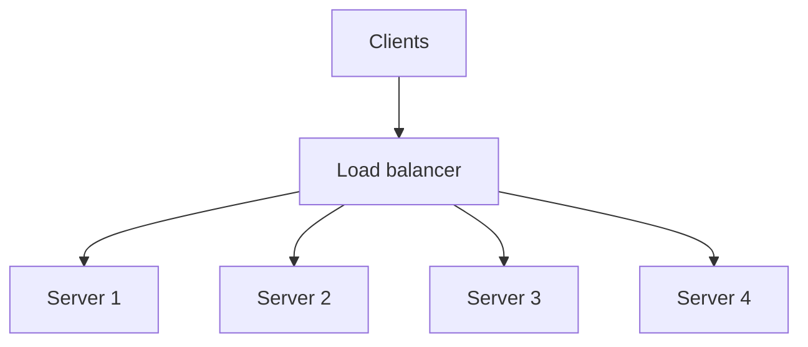

# Network Appliances
**Source provenance:** Handwritten lecture notes from Professor Messer’s free CompTIA Security+ **SY0-701** training course.
**Professor Messer course alignment:** 3.2 – Applying Security Principles → Network Appliances
**Coverage:** source pages 37–40

## Jump server
A jump server is a hardened intermediary inside a secure network that can be reached from outside for authorized administrative access. The notes emphasize:
- Internet-facing entry point.
- Hardened system.
- Used for authentication/administration.
- Commonly reached using SSH/VPN tunnels.

## Proxy
A proxy sits in the middle of a network communication and makes requests on behalf of users. It can:
- Hide direct connections.
- Make access-control decisions.
- Detect malicious traffic.
- Cache content.
- Perform URL filtering.

### Forward proxy
A forward proxy protects/controls internal users reaching the Internet.

### Reverse proxy
A reverse proxy sits in front of internal services and receives Internet-originating traffic on their behalf.

## Open proxy
The notes warn that an uncontrolled third-party proxy may become a security concern and can undermine existing controls. It may provide visibility into requests, enable modification, or act as an interception point.

## Open proxy architecture
An open proxy is an uncontrolled third-party intermediary. It may receive the user request and forward it to the Internet while creating a visibility, modification, or policy-bypass risk.

## Load balancer
A load balancer distributes traffic across servers and supports scalable implementations. The notes connect load balancing with fault tolerance and rapid handling when a server fails.

### Active/active and active/passive
- **Active/active:** all servers are active and share traffic.
- **Active/passive:** some servers serve while one or more remain ready to take over.

The notes list configuration load, TCP offload, SSL offload, encryption/decryption, caching, prioritization, and application switching as possible load-balancer functions.

## Sensors and collectors
Sensors aggregate information from network devices, IDS/IPS, logs, IoT/security-specialized devices, etc. Collectors feed SIEM consoles and other central analysis systems.
