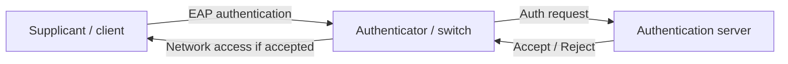

# Port Security, EAP and IEEE 802.1X
**Source provenance:** Handwritten lecture notes from Professor Messer’s free CompTIA Security+ **SY0-701** training course.
**Professor Messer course alignment:** 3.2 – Applying Security Principles → Port Security
**Coverage:** source pages 41–42

## Extensible Authentication Protocol (EAP)
EAP is an authentication framework that supports multiple authentication methods. The notes describe it as a framework whose authentication method can vary with the applicable RFC/standard and as something that integrates with 802.1X.

## IEEE 802.1X
802.1X is port-based network access control. A device does not receive normal network access until authentication succeeds.

### Components
1. **Supplicant:** the client/device requesting authentication.
2. **Authenticator:** the access device, such as a switch, that controls access to the network.
3. **Authentication server:** validates client credentials, commonly through an authentication service such as RADIUS.

The security objective is to prevent a device from communicating normally until its identity/credentials are validated.
