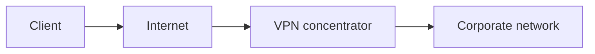
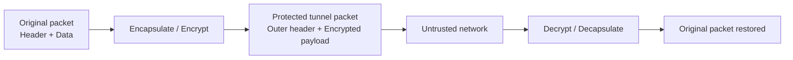
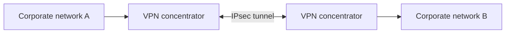

# Secure Communication: VPNs, IPsec, SSL/TLS VPN, SD-WAN and SASE
**Source provenance:** Handwritten lecture notes from Professor Messer’s free CompTIA Security+ **SY0-701** training course.
**Professor Messer course alignment:** 3.2 – Applying Security Principles → Secure Communication
**Coverage:** source pages 46–49

## VPNs
A VPN creates a secure communication path across a public/untrusted network by encapsulating/encrypting traffic. The notes associate VPN deployments with dedicated/enterprise hardware and VPN concentrators.

## Encrypted tunnel
The notebook diagram shows an original packet being wrapped with tunnel/header information so that the protected data crosses the public network in encrypted form; the outer information allows forwarding while the payload stays protected.

## Encrypted tunnel structure
The handwritten packet diagram shows the original packet being wrapped for transport across an untrusted network: forwarding information remains available outside while the protected payload is encrypted.

## Remote-access SSL/TLS VPN
The notes describe Secure Sockets Layer / TLS remote-access VPNs:
- Common HTTPS/TLS ports such as TCP 443.
- Can avoid some firewall traversal problems compared with unusual ports.
- Used for remote access.
- Can be browser-based in some deployments.

## Site-to-site IPsec VPN
Site-to-site IPsec connects two networks rather than one user to one network.

## SD-WAN
The notes describe SD-WAN as software-defined networking for WAN connectivity, with cloud-based applications communicating directly when appropriate rather than always traversing a central junction. Servers, cloud resources, and remote sites can be interconnected through software-defined policy.

## SASE
Secure Access Service Edge combines secure access/networking functions with cloud-delivered services. The notes call it an updated secure-access model for cloud services with next-generation VPN/security technology, clients on many devices, and streamlined/automated operation.

## Selection
The notes give a selection framework:
- VPN: SSL/TLS VPN for user access; IPsec tunnels for site-to-site.
- SD-WAN: manage network connections to the cloud and centralize policy.
- SASE: network/security delivered together, but requires planning and implementation.
