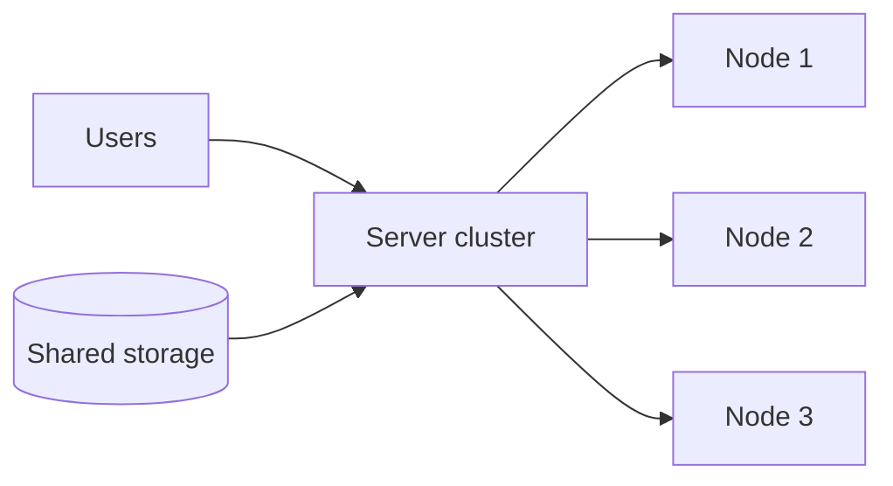

# Resiliency and High Availability
**Source provenance:** Handwritten lecture notes from Professor Messer’s free CompTIA Security+ **SY0-701** training course.
**Professor Messer course alignment:** 3.4 – Resiliency and Recovery → Resiliency
**Coverage:** source pages 59–61

## High availability
Redundancy and availability can require multiple components and can increase cost. High availability aims to keep service accessible with minimal downtime.

## Server clustering
A cluster combines two or more servers so they can operate as a larger service. The notes associate clustering with:
- Scalability.
- HA.
- Common operating-system compatibility.
- Shared storage for persistent data.

## Load balancing
A load balancer shifts and distributes load while supporting fault tolerance.

## Site resilience
A recovery site is prepared to take over after an outage. The notes distinguish:
- **Hot site:** near-ready replica, continuously updated.
- **Cold site:** empty building/space with little or no operational data/personnel.
- **Warm site:** middle ground between hot and cold.
- **Geographic dispersion:** sites should be physically separated; this helps against site-local failures but adds logistics complexity.

## Platform diversity
Using different platforms/versions can reduce common-mode failure because a flaw specific to one platform may not affect all locations.

## Multi-cloud
Data/services may be distributed across multiple cloud providers. This can reduce dependence on a single provider but increases planning and management complexity.

## Continuity of Operations Planning (COOP)
Not everything goes according to plan. The notes recommend documented alternatives for critical dependencies such as technology, manual procedures, and failover designs.

## Capacity planning
Match supply to demand across:
- People (recruitment/training).
- Technology (scalable hardware/software; examples in the notes include load-balanced or clustered servers).
- Infrastructure (additional devices/resources).
