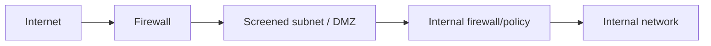

# Firewalls, Screened Subnets, IPS Rules, Proxies and DNS Filtering
**Source provenance:** Handwritten lecture notes from Professor Messer’s free CompTIA Security+ **SY0-701** training course.
**Professor Messer course alignment:** 3.2 – Applying Security Principles / 4.5 – Enterprise Security → Firewalls / IPS / Proxies / Web & DNS Filtering
**Coverage:** source pages 87–90

## Firewalls
The notes describe firewalls as monitoring traffic in both directions and identify common building blocks:
- Network-based firewall.
- NGFW with deep-packet inspection.
- Port/protocol controls.
- Firewall rules, usually evaluated from top to bottom.
- Specific rules should appear above general rules.
- Implicit deny at the bottom is a common policy pattern.
- ACL/group-based policy may be layered into firewall rules.

## Screened subnet
A screened subnet (DMZ-style architecture) adds a security boundary between the Internet and an internal organization.

The notes describe redirecting/controlling traffic through a separated subnet rather than exposing the internal network directly.

## IPS rules
IPS rules are often part of NGFW/IPS systems. They can be:
- Signature-based.
- Anomaly/behavior-based.
- Group/policy based.
- Tuned to decide what to do with unwanted traffic.

## Proxies
A proxy sits between users and an external network, receives requests on the user's behalf, and can perform additional security filtering.

## Block filtering
Block/allow decisions can be based on:
- Specific URLs.
- Site content/categories.
- Organizational position/policy.

The notes give examples such as education = allow, home/garden = allow/alert, adult = block.

## Reputation filtering
URLs can be rated based on perceived risk (bad/potentially bad, low/medium/high). Rules may be applied manually or automatically, and deposited into URL-filtering policy.

## DNS filtering
Before connecting to a website, a client typically resolves the domain through DNS. DNS security/filtering can use continuously updated threat intelligence and block known malicious destinations. The notes emphasize that filtering does not have to stop at the DNS lookup; a system may also block traffic to an external server based on security policy.
