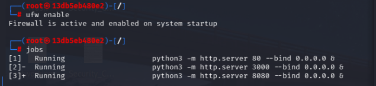
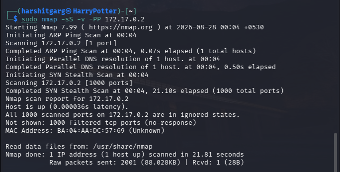
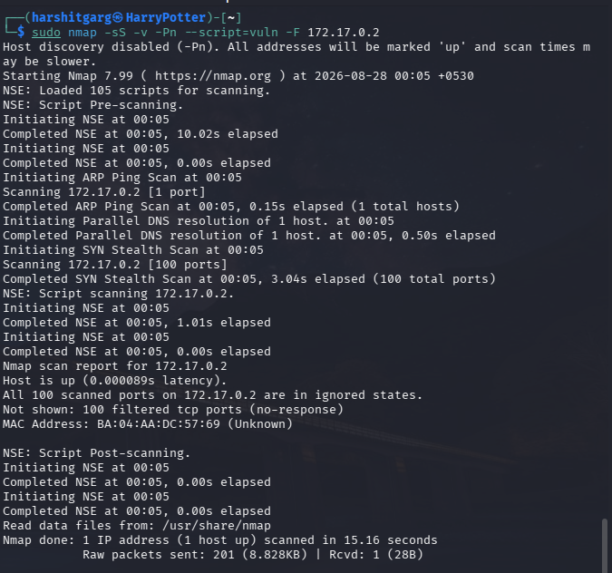
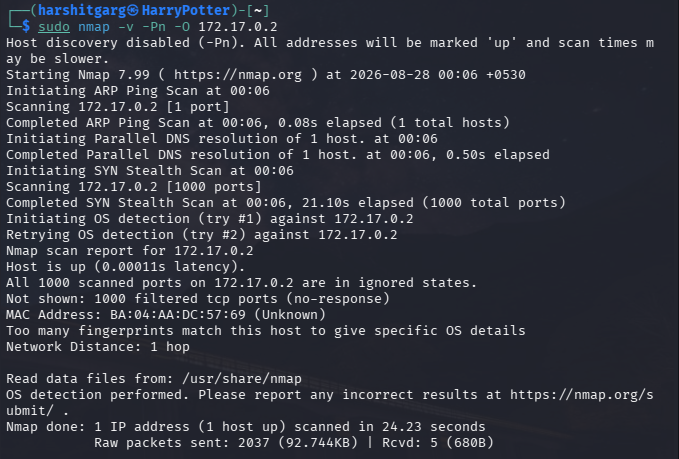
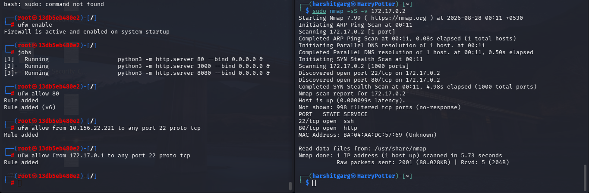
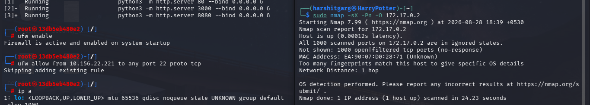

# Nmap Scan — AFTER UFW Enabled

## Purpose
Re-run the same scan after applying UFW rules to see what changed.

## Command
- start ufw on docker container with default configuration i.e block all incoming traffic and allow all outgoing traffic

  ufw enable 
- SYN scan: Performs a stealth TCP SYN scan to identify open TCP ports without completing the full TCP handshake.
  
  nmap -Pn -sS -v <container_ip>

- Xmas scan: Sends TCP packets with FIN, PSH, and URG flags set to infer port states without a normal SYN connection
  
  nmap -Pn -sX -v <container_ip>.

- NSE scripts: Performs a SYN scan and runs Nmap's standard scripts to gather additional information about discovered services.
  here to find known vulnerabilities.
  
  nmap -Pn -sS --script=vuln <container_ip>

- allow/deny a specific port to listen openly by configuring ufw

  ufw allow/deny <port number>

- **Advanced config command**
  sudo ufw allow/deny from <ip address> to <protocol> port <port number>

## Output
- Enabled the firewall with default config
  

- run the nmap scans now, try different flags
  
  
  

- config firewall to allow traffic on some ports, now re run nmap scans
  
  

- ran different nmap commands with live logiing on container
  details can be found in [log-analysis](log-analysis.md)
  
## Observations
- with default ufw config which blocks all incoming traffic, no nmap command or built-in script could produce anything meaningful.
- learnt how to configure a firewall rules and how they work
- log analysis deepened my knowledge the nmap packets and firewall packets management 
