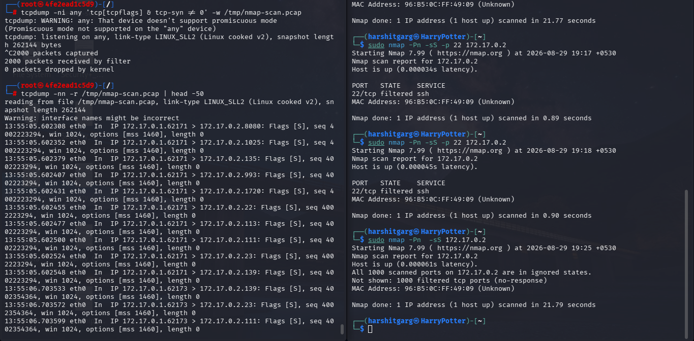
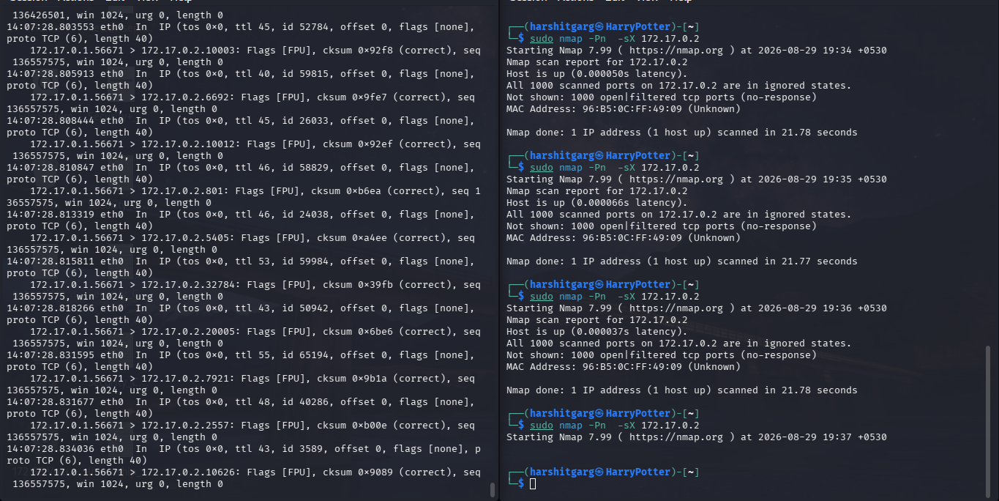
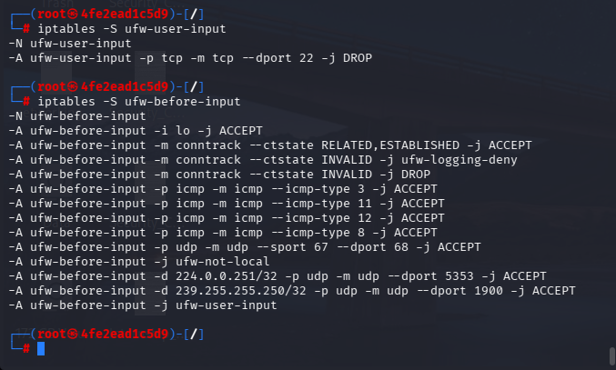
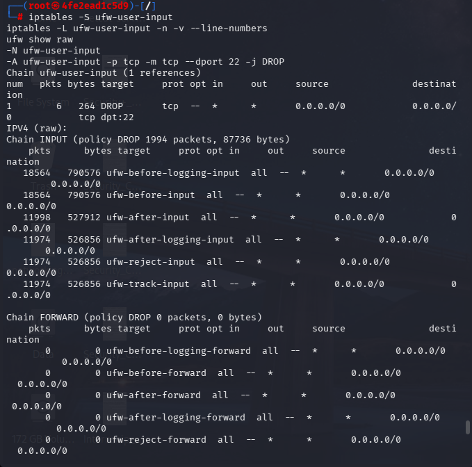
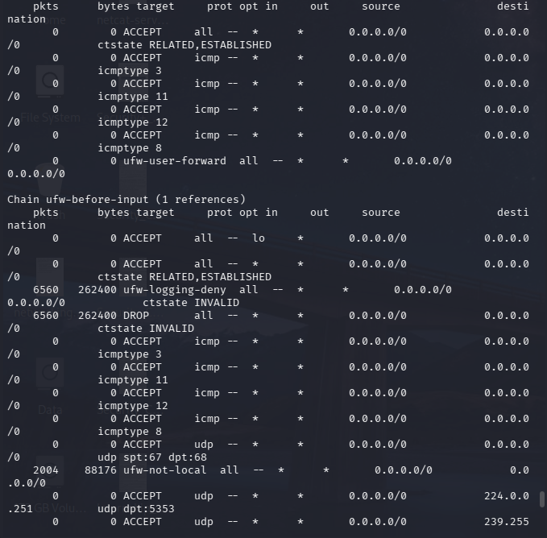
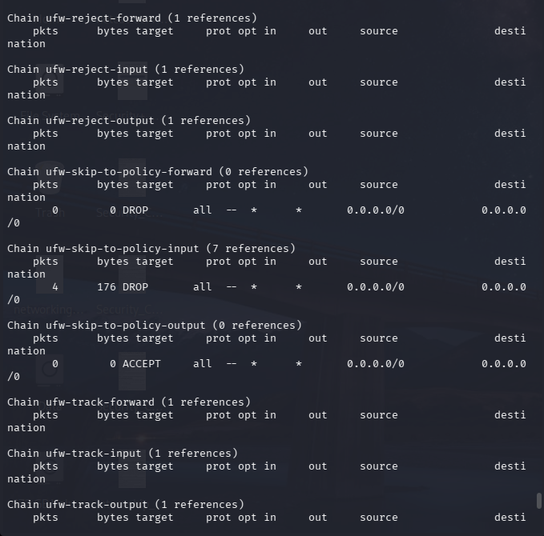
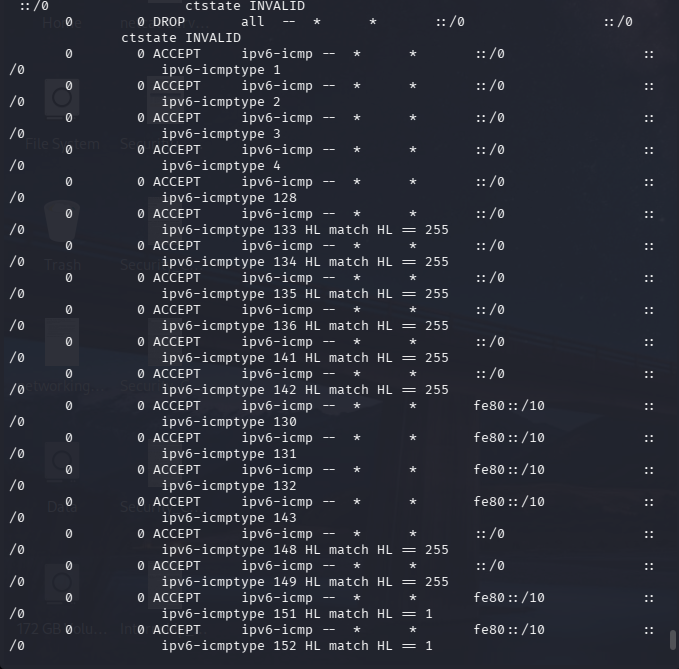
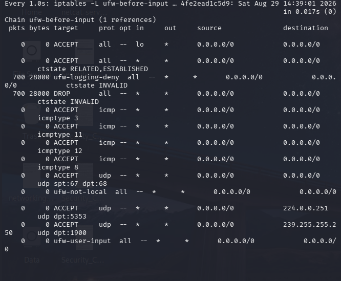
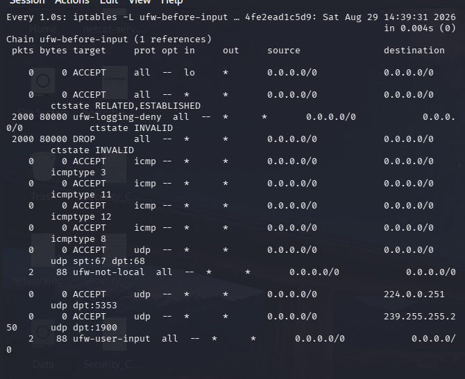

# Log Analysis — UFW Block Events

## Purpose
Capture and analyze the actual UFW log output generated while the Nmap scans
were running, to confirm blocked connection attempts are visible and to show
what a detection query against this data would look like.

## Setup
```bash
# Inside the container - make sure UFW logging is on
ufw logging on

# Tail the log while running the attack scans from the attacker machine
touch /var/log/ufw.log
tail -f /var/log/ufw.log
```
In my setup here, due to some config issues because to using same machine I used tcpdump on the container to analyze logs.
I did try many troubleshoots but to no effect so here I am with tcpdump logs and iptables counters.
Will update if the issue gets resolved

## Raw Log Output

## tcpdump logs and iptables counters

 
 
 
 
 

 

 

 

 

 

 

Despite `ufw logging on` being enabled and `rsyslogd` running inside the
container, `/var/log/ufw.log` never populated with entries — including after
enabling `ufw logging full` and confirming rsyslog was active. Investigation
traced this to `imklog` (rsyslog's kernel-log input module) requiring the
`SYSLOG` capability to read kernel netfilter LOG output inside a container
namespace, which is not granted by default even with `--cap-add=NET_ADMIN`.

Rather than fabricate log lines, the underlying block behavior was verified
through two other methods:

## Verifying the block — iptables counters
```bash
watch -n1 'iptables -L ufw-before-input -n -v'
```
While running `nmap -Pn -sS <container_ip>` from the attacker machine, the
packet/byte counters on the DROP rule for the tested ports incremented in
real time — confirming UFW's rule is actively matching and dropping the
scan traffic, independent of whether it's being logged to a file.

## Verifying the block — tcpdump
```bash
tcpdump -i eth0 -n tcp -w /tmp/scan-capture.pcap
```
Run concurrently with the Nmap scan, then read back with:
```bash
tcpdump -r /tmp/scan-capture.pcap -n
```
This showed SYN packets arriving from the attacker IP on the tested ports
with no corresponding SYN-ACK reply — the packet-level signature of a
dropped connection, matching Nmap's own "filtered" classification for
those ports.

## Observations
- The `ufw.log` gap is itself the most useful finding here: relying on a
  single log source is fragile. If a SOC were depending solely on UFW's
  file-based log for detection, this exact rsyslog/kernel integration issue
  would create a silent blind spot — the firewall could be working
  perfectly while producing zero evidence of it.
- iptables counters and packet capture are lower-level and don't depend on
  a working syslog pipeline, making them more reliable as a fallback
  verification method.
- Nmap's own scan result ("filtered" vs "closed") independently corroborated
  the drop — three separate signals (UFW counters, tcpdump, Nmap
  classification) all agreeing gives higher confidence than any other alone.

## Basic Detection Query (conceptual)
If this log were ingested into a SIEM, the equivalent of "flag a port scan" is:
count(distinct dst_port) by src_ip within 60s > threshold

This is the same logic behind the Sigma rule idea in the main README's 
Detection Angle section — this file is the evidence that logic actually holds 
up against real log data, not just a theoretical claim.

## Key Takeaway
A firewall rule working and a firewall rule being *observable* are two
different things. This lab set out to prove detection logic against UFW
logs, but the more valuable result was discovering that container logging
pipelines have a non-obvious dependency (kernel log access via the SYSLOG
capability) that can break silently — the kind of gap that's easy to miss
in production until an incident happens and the logs simply aren't there.
*If anyone has face similar issue while setting up similar lab and facing 'no logs'
issue and troubleshooted the problem, i would love to get insights - so please do contact me 
through mail- 'harshitagrwl1608@gmail.com'
