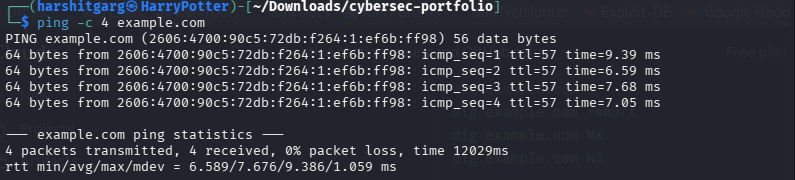
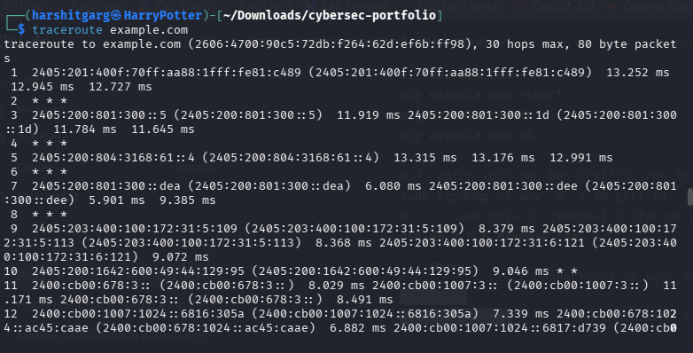
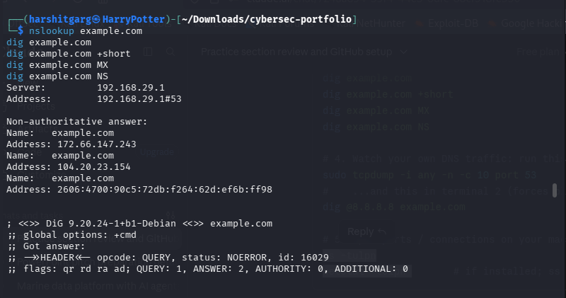
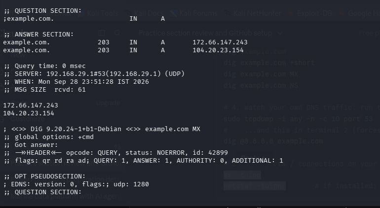
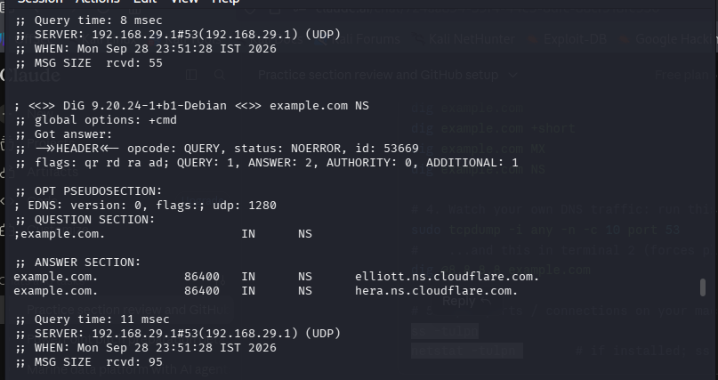
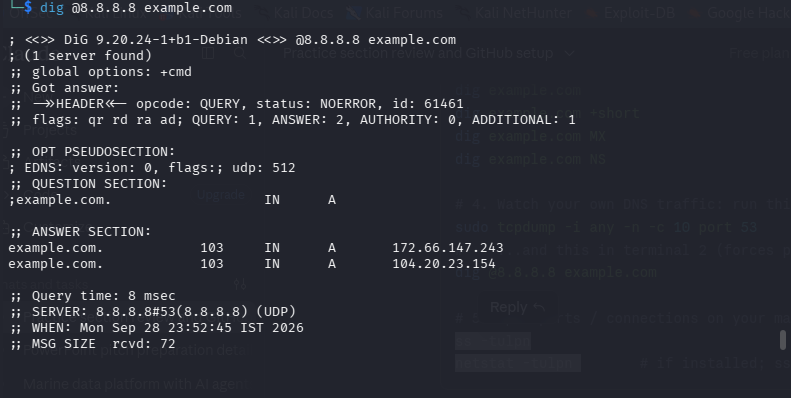
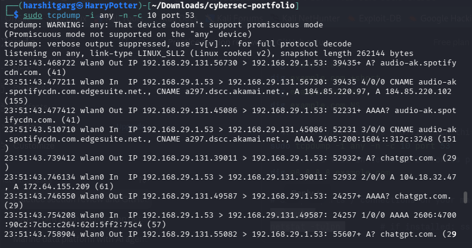
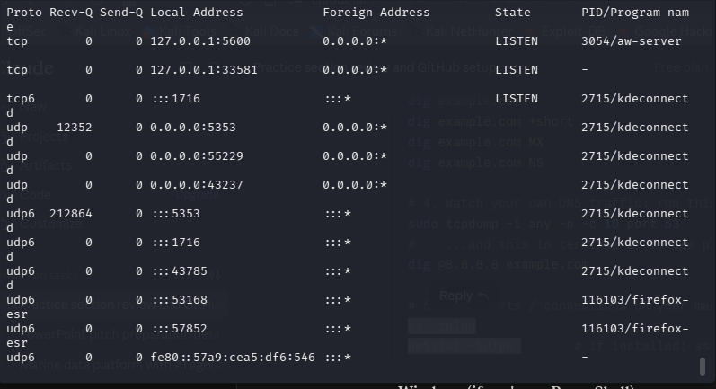
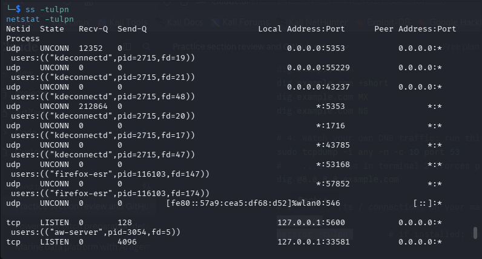

# Network Command-Line Tools

**Date:** 2026-09-28  
**Category:** Networking / Troubleshooting

## Objective
Learn common command-line tools used to troubleshoot network connectivity, routing, DNS, packet capture, local connections, interface configuration, and ARP information.

## Tools used
- `ping`
- `traceroute`
- `nslookup`
- `dig`
- `tcpdump`
- `netstat`
- `ss`
- `ip addr`
- `ifconfig`
- `ipconfig`
- ARP

## Methodology

### 1. `ping`
Tests device availability using ICMP packets. The notes also mention that ICMP may be blocked.

```bash
ping -c 4 example.com
```



---

### 2. `traceroute`
Maps the route taken by a packet toward a host. It uses TTL expiry to reveal hops; ICMP responses may be filtered.

```bash
traceroute example.com
```



---

### 3. `nslookup` and `dig`
Used to query DNS servers for domain/IP resolution.

```bash
nslookup example.com
dig example.com
dig example.com +short
```



#### `dig` — MX record

```bash
dig example.com MX
```



#### `dig` — NS record

```bash
dig example.com NS
```



#### `dig` — query a specific DNS server
The notes show forcing a DNS lookup through Google DNS so the DNS traffic can be observed on port 53.

```bash
dig @8.8.8.8 example.com
```



---

### 4. `tcpdump`
Captures packets from the command line. The notes mention viewing/saving captures, applying filters, and analysing captures with Wireshark.

```bash
sudo tcpdump -i any -n -c 10 port 53
```



---

### 5. `netstat`
Used for network statistics and viewing active connections.

```bash
netstat -tulpn
```

Options noted:
- `-a` → all active connections
- `-n` → does not resolve names



---

### 6. `ss`
Used to inspect open ports and network connections on the machine. The notes describe `ss` as the modern replacement for `netstat`.

```bash
ss -tulpn
```



---

### 7. `ip addr` / `ifconfig` / `ipconfig`
Used to find network interfaces and IP addresses.

```bash
ip addr
ifconfig
ipconfig
```


---

### 8. ARP
Used to determine the MAC address associated with an IP address, from the ARP cache.


## Detection angle (SOC-relevant)
These commands can also appear during troubleshooting or investigation. Useful evidence can include DNS queries, packet captures, active connections, interface changes, and ARP information.

## Key takeaway
These tools provide different views of the same network problem: reachability, route, DNS, packets, local connections, interface configuration, and ARP state. The important part is choosing the tool that matches the symptom being investigated.
