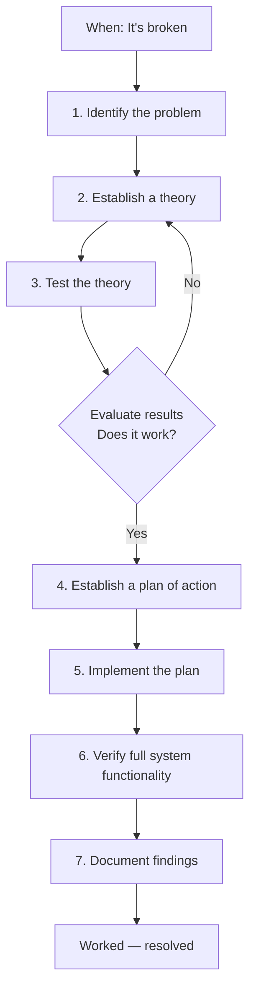

# Network Troubleshooting Methodology — N10-009

> A practical, repeatable workflow for diagnosing and resolving network problems, based on the **CompTIA Network+ N10-009** troubleshooting section studied on **August 25, 2026**.

**Path:** CompTIA Network+ (N10-009) → Section 5.1–5.2  
**Date:** 2026-08-25  
**Category:** Networking / Troubleshooting  
**Primary source:** Professor Messer — N10-009

## Objective

Build a repeatable troubleshooting process rather than memorizing isolated commands. The August 25 study block focused on troubleshooting methodology plus physical, interface, and hardware issues.

## What I Studied

Professor Messer N10-009 videos:

| Topic | Runtime |
|---|---:|
| Network Troubleshooting Methodology | 8:04 |
| Cable Issues | 14:40 |
| Interface Issues | 9:29 |
| Hardware Issues | 7:34 |
| **Total** | **39:47** |

This corresponds to **N10-009 §5.1–5.2**. The roadmap notes that Section 5 represents **24% of the N10-009 exam**, so this block is intended to be studied carefully rather than rushed.

## Core Troubleshooting Workflow

> **Identify → Establish a theory → Test the theory → Evaluate → Establish a plan → Implement → Verify → Document**

The process is iterative. If a tested theory does not explain the problem, return to theory generation and investigate another probable cause.

### Flowchart



## 7-Step Methodology

| Step | Purpose | Key actions |
|---|---|---|
| 1. Identify the problem | Understand what is actually broken | Gather information, reproduce the issue, question users, identify symptoms, ask what changed |
| 2. Establish a theory | Form a probable cause | Start with obvious causes, inspect the OSI stack, use top-down/bottom-up reasoning, divide and conquer |
| 3. Test the theory | Determine whether the theory explains the symptom | Perform a controlled/minimal test and observe the result |
| 4. Establish a plan | Decide how to fix it safely | Choose a low-impact approach, record the current state, prepare rollback |
| 5. Implement the plan | Apply the selected fix | Make the planned change and escalate when necessary |
| 6. Verify functionality | Confirm the fix actually solved the problem | Test the original failure and relevant user workflows |
| 7. Document findings | Preserve what was learned | Record cause, evidence, fix, verification, and useful history |

## Physical / Interface / Hardware Issues

### Cable issues

Common physical-layer symptoms to recognize include:

- CRC errors
- Attenuation
- Crosstalk
- Intermittent connectivity
- Link instability

When investigating a suspected cable problem, start with the physical path and compare against a known-good cable or port where practical.

### Interface issues

Check the network interface itself and its state before assuming the problem is higher in the stack.

Useful observations include:

- Interface/link status
- Negotiated speed and duplex
- Error counters
- Driver/interface state
- Whether the problem follows the interface, cable, or port

### Hardware issues

Hardware failures can present as connectivity problems even when configuration appears correct. Consider the NIC, switch/router port, power, and other relevant physical components.

## Troubleshooting Principles

### Start with the obvious

Check simple, high-probability causes before jumping into complex explanations:

- Power and physical connectivity
- Correct cable/port
- Link/activity status
- Wi-Fi association
- IP configuration
- DNS configuration
- Recent changes
- Service/application status

### Use the OSI model

Investigate from the top of the OSI model to the bottom and reverse direction when appropriate. Use the symptoms and evidence to decide where to start instead of mechanically checking every layer.

See [`docs/osi-troubleshooting.md`](docs/osi-troubleshooting.md).

### Divide and conquer

Break the problem into smaller independently testable sections:

- Client vs. network
- LAN vs. WAN
- DNS vs. connectivity
- One host vs. many hosts
- Physical layer vs. configuration vs. application

### Minimize impact

During testing and implementation:

- Prefer controlled changes.
- Change one meaningful variable at a time where practical.
- Record the original state.
- Have a rollback plan.
- Avoid unnecessary disruption to other users.

## Practice Task — August 25

The roadmap's hands-on task for this day was:

1. Write the **7-step troubleshooting methodology from memory**.
2. Invent a scenario such as **"user says Wi-Fi is down"**.
3. Write the question you would ask at each troubleshooting step.

A reusable practice worksheet is included in [`docs/troubleshooting-checklist.md`](docs/troubleshooting-checklist.md).

## End-of-Day Check

The planned checkpoint for August 25 was:

- Recite the troubleshooting methodology in order, unaided.
- Name **three physical-layer symptoms** — CRC errors, attenuation, and crosstalk — and explain their causes.

## Security Relevance

Network troubleshooting is also useful in security operations because a structured troubleshooting process helps distinguish configuration, availability, physical, and application problems from security-related symptoms. The same evidence-first mindset supports incident investigation: observe the symptom, form a hypothesis, test it, evaluate the evidence, and document the result.

## Repository Structure

```text
network-troubleshooting-methodology/
├── README.md
├── .gitignore
├── docs/
│   ├── methodology.md
│   ├── osi-troubleshooting.md
│   └── troubleshooting-checklist.md
├── notes/
│   └── handwritten-notes.md
├── templates/
│   └── incident-report.md
└── evidence/
    └── README.md
```

## Key Takeaway

> **Observe → hypothesize → test → evaluate → act → verify → document.**

The important skill is not knowing every command. It is being able to narrow an unknown problem into testable hypotheses and use evidence to decide the next step.
