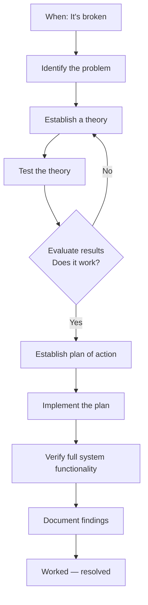
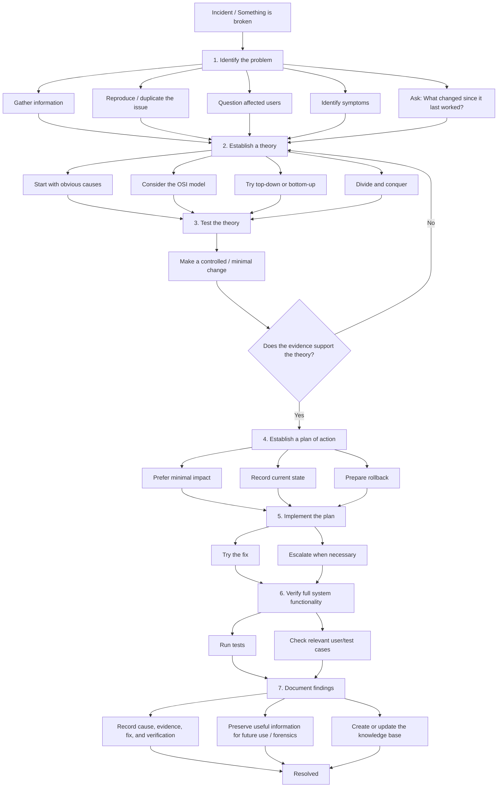

# Troubleshooting Flowchart

## 1. Core flow



## 2. Expanded practical flow



## 3. Loop logic

```text
Establish theory
       ↓
   Test theory
       ↓
Evaluate result
   ↙       ↘
 No         Yes
 ↓           ↓
New theory   Plan
```

A failed hypothesis is evidence that the current theory needs to be revised; it is not a reason to force the original explanation to fit the evidence.

## 4. Compact ASCII version

```text
[It's broken]
      |
      v
[Identify problem]
      |
      v
[Establish theory] <------------------+
      |                               |
      v                               |
[Test theory]                         |
      |                               |
      v                               |
[Evaluate: Does it work?]             |
    |             |                   |
   No            Yes                  |
    |             |                   |
    +-------------+                   |
                  v                   |
       [Establish plan of action]     |
                  |                   |
                  v                   |
          [Implement the plan]        |
                  |                   |
                  v                   |
       [Verify full functionality]    |
                  |                   |
                  v                   |
         [Document findings]          |
                  |                   |
                  v                   |
             [Resolved] -------------+
```
