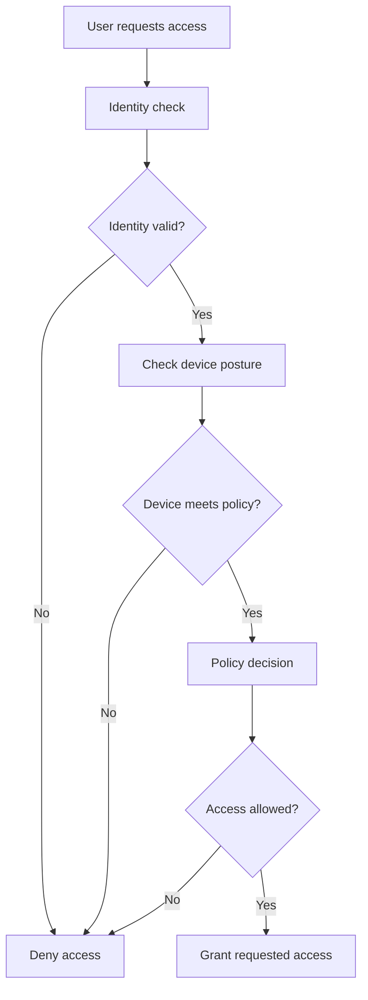

# Zero Trust Laptop Login Flow

**Path:** CompTIA Security+ (SY0-701) / Zero Trust
**Date:** 2026-09-08
**Category:** Zero Trust / Authentication / Authorization

## Objective
Document a zero-trust login flow for a laptop using identity verification, device posture, policy evaluation, and an access decision.

## Tools used
- Laptop login/authentication system
- Device posture/security checks
- Access policy engine

## Methodology
A zero-trust login can be represented as:



The important sequence is **identity → device posture → policy decision → access**, rather than trusting the device merely because it is already inside a network.

```text
No commands required.
```

## Detection angle (SOC-relevant)
Useful SIEM evidence includes failed authentication events, device-compliance/posture failures, policy-deny events, repeated access attempts, and successful grants following a valid identity and compliant posture.

## Key takeaway
Zero trust treats access as something to verify repeatedly rather than assuming trust from network location alone.
