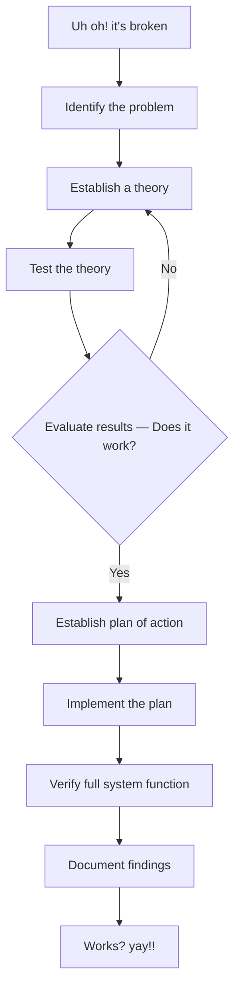

# Network Troubleshooting Methodology

**Source pages:** added notes PDF, pages 10–13.

## Flowchart

## 1. Identify the problem
- Gather info.
  - E.g. log duplicating issue.
  - Question users.
  - Identify symptoms.
- What has changed??
  - From when it was working fine?

## 2. Establish theory
- Start with obvious.
- Consider everything.
  - Examine problem from top of OSI model to bottom.
  - And reverse.
- Divide & conquer.

## 3. Test the theory
- A virtual / test change.
- Yes → continue.
- No → re-establish theory.

## 4. Create a plan
- Build a plan.
  - With minimum impact on uptime.
- Have backup plans (rollback tool).

## 5. Implementation
- Try the fix.
- Escalate as necessary.
  - 3rd party.

## 6. Verify system function
- Testing → use case(s).

## 7. Document finding
- For future use.
- Forensics.
- Create a formal DB **[source wording unclear]**.
