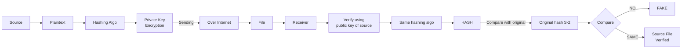

# Non-Repudiation, Integrity & Origin

**Combined source pages:** See INDEX.md. **Later-notes source PDF:** page(s) are listed in INDEX.md.

### Page 4
# Non-repudiation
- Can't deny what you said in a contract
- Confirms IT was you
- Can add a digital perspective for cryptography

## Proof of integrity
- Verify data hasn't been changed
- In cryptography:
  - Use a hash
  - Data change -> hash change
  - Even a minor change -> major impact
  - Does not reveal data / content

## Proof of origin
- Prove source of the message
- Sign with private key
- Check with public key

### Page 5

## Digital reconstruction of the handwritten flowchart

## Flow: proof of origin / integrity
`Source -> Plaintext -> Hashing algo -> Private key (signing) -> Over Internet -> Receiver`

Receiver:
- Verify using public key of sender
- Same hashing algo
- `HASH` -> compare with original hash -> if **NO**: FALSE; if **SAME**: SOURCE AUTH VERIFIED

