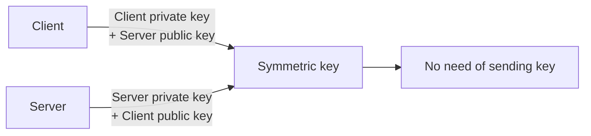

# Key Exchange

**Combined source pages:** See INDEX.md. **Later-notes source PDF:** page(s) are listed in INDEX.md.

### Page 32

## Digital reconstruction of the handwritten flow

> Reconstructed from the page-32 sketch: Client -> Session Key -> encrypt using server public key -> Server.

# Key Exchange
- A logistical challenge

1. **Out-of-band exchange**
   - Not through net
   - E.g. telephone, courier etc.
2. **In-band key exchange**
   - Over network
   - Protect key using odd encryption
   - E.g. use asymmetric key to deliver a symmetric key

## Real-time encrypt/decrypt
- Need for fast securing
- Secure a symmetric key using asymmetric encryption
- E.g. session keys
- Client -> session key -> [encrypt using session key / server public key] -> server
- Implement carefully
  - change often (ephemeral keys)
  - Imperceptible [as written]

### Page 33

## Digital reconstruction of the handwritten flow

> The source uses the word “same” under the derived symmetric key; the reconstruction keeps the two paths converging on the same symmetric-key result.

# Symmetric keys from asymmetric keys
- Use public/private key cryptography to create a symmetric key

Flow:
- Client [encrypt with server public key] -> symmetric key -> server [server private key]
- Symmetric key is then used
- No need of sending keys [thereafter]
