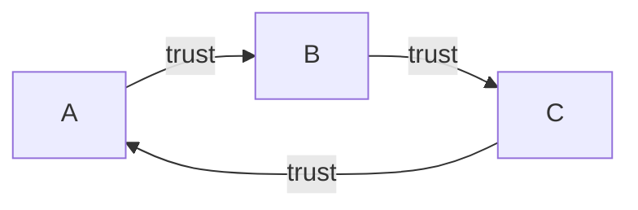

# Certificates & Root of Trust

**Combined source pages:** See INDEX.md. **Later-notes source PDF:** page(s) are listed in INDEX.md.

### Page 43
# Certificates
## Digital certificate
- Public key certificate
  - bind public key with a CA and other details
- A digital sign adds trust
  - it's all about who to TRUST
- Certificate creation can be built into OS
- X.509 -> standard format

## Details
- Serial no.
- Version
- Sign algo
- Issuer
- Name of holder
- Public key
- Extension
- and more

### Page 44

## Digital reconstruction of the trust-chain sketch



> This is a direct reconstruction of the three-node trust relationship drawn on the page.

# Root of Trust
- Everything associated req. trust
- How to build it?
- Refer to root of trust
  - a trusted comp
  - hardware, software, firmware & other comp.
  - e.g. HSM, security enclave, CA etc.

## Certificate Authority
- Connect to random website -> ensure you trust
- Check if it is signed by a CA your browser/system trust
- A trust B
- B trust C
- C -> A [trust relationship diagram as drawn]

### Page 45

## Digital reconstruction of the Certificate Signing Request (CSR) flow

```mermaid
flowchart LR
    AP[Applicant]

    K1[App. Private Key]
    K2[App. Public Key]
    ID[Applicant Identity Form]
    CSR[Certificate Signing Request (CSR)]
    V[Validate Applicant Identity]
    CPK[CA's Private Key]
    CERT[Digitally Signed Certificate]

    K1 --> CSR
    K2 --> CSR
    ID --> CSR
    CSR --> V
    V --> CPK
    CPK --> CERT
    CERT --> AP
```

> The page-45 drawing shows the applicant creating a CSR from the app private/public keys and applicant identity form, followed by identity validation and CA signing.

## Third-party CA
- Built-in your browser
- Perhaps your website certificate
- CA is responsible for verifying the request
  - CA however may verify your identity

## Root of Trust

## Certificate Signing Request (CSR)
Flow:
- App. private key + App. public key -> Certificate Signing Request (CSR)
- Applicant submits request
- Validate applicant identity
- CA's private key -> digitally signed certificate
- Certificate published

### Page 46
# Private CA
- You are your own CA
  - for internal network
  - add it to trusted chain
- For medium-to-large companies
- Implement as part of your overall computing strategy
  - Windows cert services
  - OpenCA

## Self-signed certificate
- Internal certs don't need to be signed by public CA
- Install CA certificate / trusted chain on EACH DEVICE
