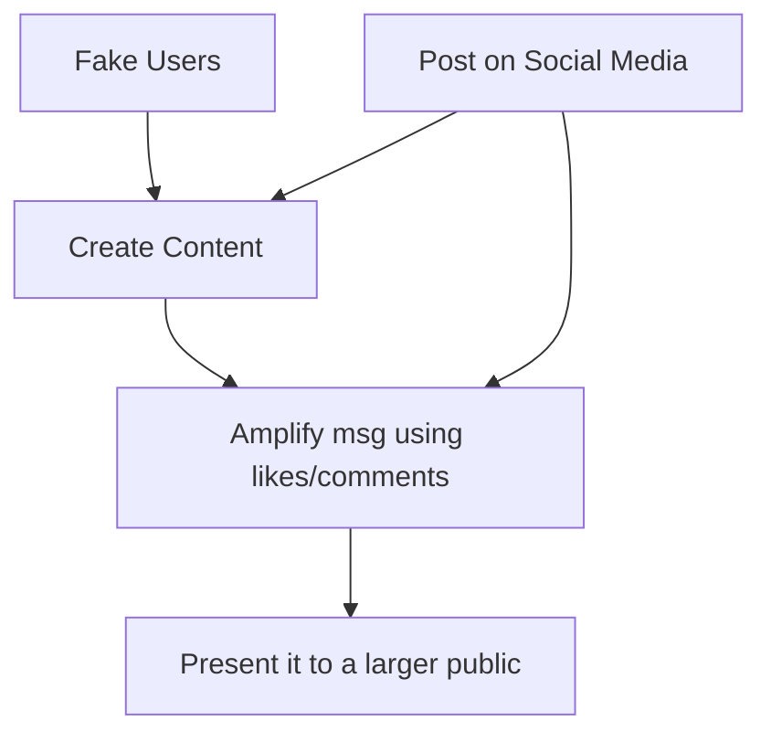

# Social Engineering & Impersonation

**Combined source pages:** See INDEX.md. **Later-notes source PDF:** page(s) are listed in INDEX.md.

### Page 58
# Impersonation
## Pretext
- Setting a trap - story
- E.g. “My name is Wendy and I'm from Microsoft, this is an urgent call to check up your computer for potential malware.”

## Impersonation
- Pretending someone they are not
  - E.g. person from govt etc.
  - throwing tons of tech info to distract
- Use details from reconnaissance

### Page 59
# Elicit Information
- Get info from victim without him realizing what he is sharing
- Often seen as vishing
- Make it important gain trust
  - don't just ask your password directly

# Identity fraud
- Using your identity to open up account anywhere
  - E.g. a credit card in bank account
- Gain access & benefit from your identity

### Page 60
# Watering Hole Attack
- Attacker can't get in any way
- So they will just poison a watering hole; wait for you to drink from it
- Determine which website the victim group uses
- Infect one of these websites
  - then wait for target to get infected
  - infect all visitors
- Requires a lot of research

## To defend
- Firewall + AV + IPS
- Signature blocking

### Page 61

## Digital reconstruction of the misinformation / disinformation process

# Other Social Eng. Attacks
## 1. Misinformation / disinformation
- Create confusion, chaos by spreading false info
  - political
  - religious
  - or any way to organise chaos
- E.g. advertisements
- social media

### Process (flow)
`Fake users -> post on social media -> create content -> amplify using like/comments -> present to a larger public`

### Page 62
## 2. Brand impersonation
- Pretend to be a well-known brand
- Creates tens of thousands of impersonation sites
  - click a Ad -> redirect
- Pop-up malwares
- Malware injection!!
