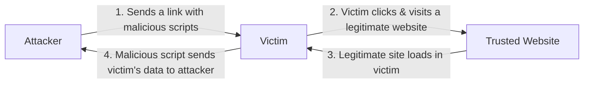

# Cross-Site Scripting (XSS)

**Combined source pages:** See INDEX.md. **Later-notes source PDF:** page(s) are listed in INDEX.md.

### Page 72

## Digital reconstruction of the handwritten XSS flow

> The page-72 sketch is reconstructed as the attacker → victim → trusted website path, with the malicious script returning victim data to the attacker.

# Cross-site scripting (XSS)
- Originally called cross-site because of browser security flaw
  - Info from one site could be shared to another
- One of most common web vuln
  - takes advantage of trust a website has for a site
  - although complicated
- XSS commonly uses JS
  - everyone usually has JS enabled

### Page 73
# Non-persistent (reflected) XSS attack
- Website allows scripts to run in user input
- Attacker exploits a flaw / vulnerability
  - sends victim a link to steal data
- Script is embedded in URL / executes in victim's browser
  - Attacker gets data
  - Gain access -> spyware

# Persistent (stored) XSS attack
- Attacker posts a msg to a social network
  - includes malicious code
  - it is persistent
  - everyone viewing gets it

### Page 74
## Stored XSS continuation
- For social networks, this can spread quickly
  - everyone who views msg can have that JS/code executed
- E.g. Justin B? / Aaron? [handwritten example unclear]
- Hacking a server

# Protecting against XSS
1. Never open links -> browse manually
2. Consider disabling JS
3. UPDATE
4. Validate input anyway as a developer
