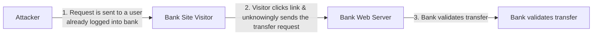

# Cross-Site Requests / CSRF

**Combined source pages:** See INDEX.md. **Later-notes source PDF:** page(s) are listed in INDEX.md.

### Page 113
# Cross-Site Requests
- A webpage may load info from diff servers
  - E.g. a youtube video, photos from diff sources
- HTML? [Normal & expected]
- Most of these are uncommon [wording unclear]

## Client / Server
- Website -> client-side code
  - Browser
  - JS, HTML
- Server side
  - performs request from client
  - HTML, PHP
  - E.g. transfer money bits
  - no such? investment

### Page 114
# Cross-Site Request Forgery (CSRF)
- Attacker knows some site is a client, some-server??
  - take adv. of this
- One click attack, session riding
  - E.g. XSRF, CSRF (see army?)
- Take advantage that a web app has a user
  - request made without your consent / knowledge
  - E.g. post of social media
- This is a significant web app development oversight
  - app should have anti-forgery token

Flow:
1. Request is sent via attacker to a user who is already logged into bank website
2. Victim clicks link attacker sends the transaction to bank server
3. Bank validates transfer [continuation on next page]

### Page 115

## Digital reconstruction of the handwritten CSRF flow

> Reconstructed conservatively from the page-115 sketch. The handwritten diagram clearly shows steps 1, 2, and 3; the final outcome is not made more specific than the source.

# Cross-Site Request Forgery (CSRF) - continuation
- Continue flow: attacker causes transfer request; bank web server; bank validates transfer
- Web request can be made while victim is authenticated
- Anti-CSRF token / anti-forgery token should be used
