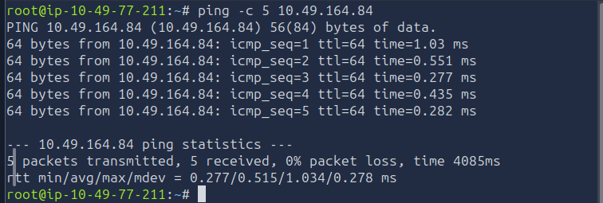
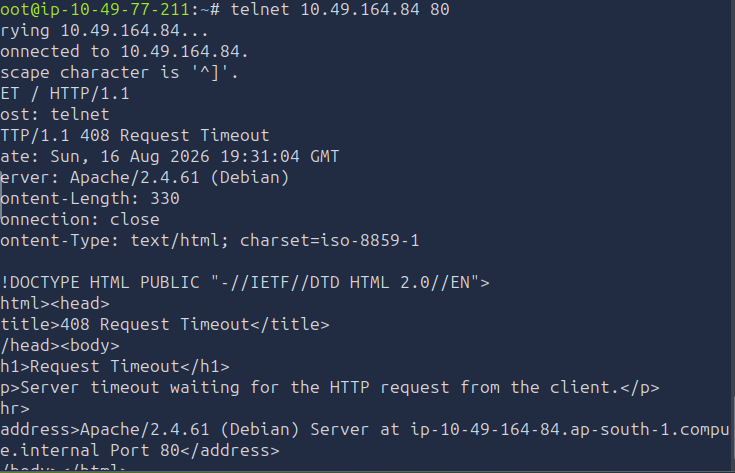
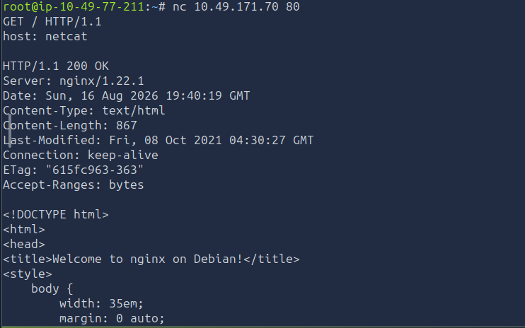
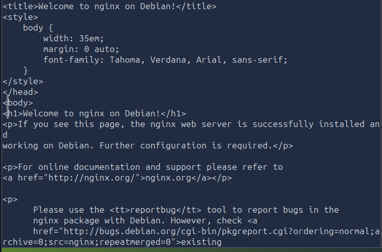

# [Active Reconnaissance] — TryHackMe

**Path:** Jr Penetration Tester
**Date:** 2026-08-10
**Category:** Reconnaissance — Active

## Objective
Learn basic tools that directly interact with the target — traceroute, ping,
telnet, and a browser — trading passivity for more detailed information.

## Tools used
- traceroute, ping, telnet, browser
- netcat
- Developer Tools on browsers

## Methodology
- ping an IP Address to check if it is online and running
- Analyzing ICMP packets 
- telnet helped me service banners from running open ports. Service banners can be used for knowing
  what system and version target is on
- similar to telnet, netcat is a modern version, It is much more helpful and reliable
  providing a list of flags hat can be used

**Ping an IP**

**Using TelNet on a open post for Banner Grabbing**

**Using netcat on a open post for Banner Grabbing**

## Detection angle (SOC-relevant)
Even simple tools like ping/traceroute generate ICMP traffic that's logged —
a single ping is nothing, but repeated pings/traceroutes to varied ports
from one source starts looking like recon.

## Key takeaway
How reliable potentially great information can be extracted from host before exploitation.
